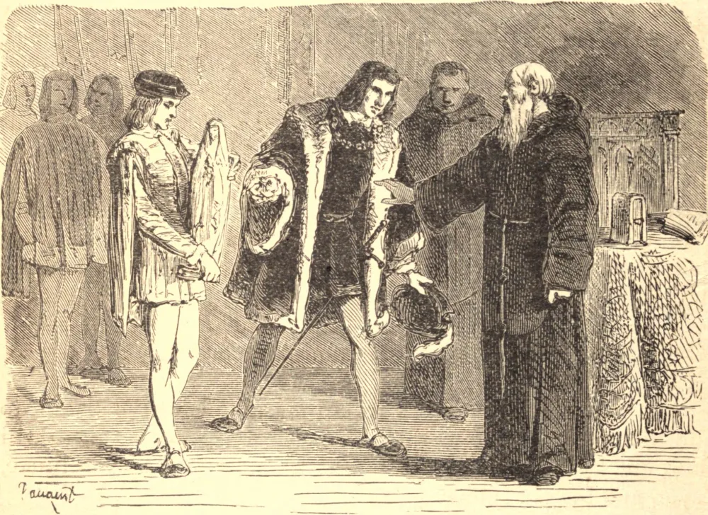

# 2 de abril — SÃO FRANCISCO DE PAULA

AOS quinze anos de idade, Francisco deixou seu pobre lar em Paula, na Calábria, para viver como eremita numa gruta junto à costa marítima. Com o tempo, discípulos reuniram-se ao seu redor, e com eles, em 1436, fundou os "Mínimos", assim chamados para mostrar que eram a menor das Ordens monásticas. Observavam uma Quaresma perpétua, e nunca tocavam carne, peixe, ovos ou leite. O próprio Francisco fazia da rocha o seu leito; sua melhor vestimenta era um cilício, e ervas cozidas o seu único alimento. À medida que seu corpo se mirrava, sua fé tornava-se poderosa, e ele "tudo podia n'Aquele que o confortava." Curava os enfermos, ressuscitava os mortos, afastava as pestes, expulsava os espíritos malignos, e trazia os pecadores à penitência.

Um famoso pregador, instigado por alguns monges desencaminhados, pôs-se a pregar contra São Francisco e seus milagres. O Santo não fez caso disso, e o pregador, vendo que nada conseguia com seus ouvintes, resolveu ver este pobre eremita e confundi-lo em pessoa. O Santo recebeu-o com bondade, deu-lhe um assento junto ao fogo, e escutou uma longa exposição de suas próprias fraudes. Tomou então tranquilamente algumas brasas ardentes do fogo, e, fechando as mãos sobre elas sem se ferir, disse: "Vinde, Frei Antônio, aquecei-vos, pois estais tiritando por falta de um pouco de caridade." Frei Antônio, lançando-se aos pés do Santo, pediu-lhe perdão, e então, havendo recebido seu abraço, dele se despediu, para tornar-se seu panegirista e alcançar ele próprio grande perfeição.

Quando o avarento Rei Fernando de Nápoles lhe ofereceu dinheiro para seu convento, Francisco disse-lhe que o devolvesse a seus súditos oprimidos, e amoleceu-lhe o coração fazendo brotar sangue da moeda mal adquirida.

Luís XI da França, tremendo ante a aproximação da morte, mandou chamar o pobre eremita para afastar o inimigo cujo avanço nem suas fortalezas nem seus guardas podiam deter. Francisco foi por ordem do Papa, e preparou o rei para uma santa morte. Os sucessores de Luís cumularam o Santo de favores, sua Ordem espalhou-se por toda a Europa, e seu nome foi venerado por todo o mundo cristão.

Morreu com a idade de noventa e um anos, na Sexta-Feira Santa de 1507, com o crucifixo na mão, e as últimas palavras de Jesus nos lábios: "Em Tuas mãos, ó Senhor, entrego o meu espírito."

**Reflexão**—Confia em todas as dificuldades em Deus. Aquilo que capacitou São Francisco a operar milagres fará, na devida proporção, maravilhas por ti mesmo, dando-te força e consolação.
