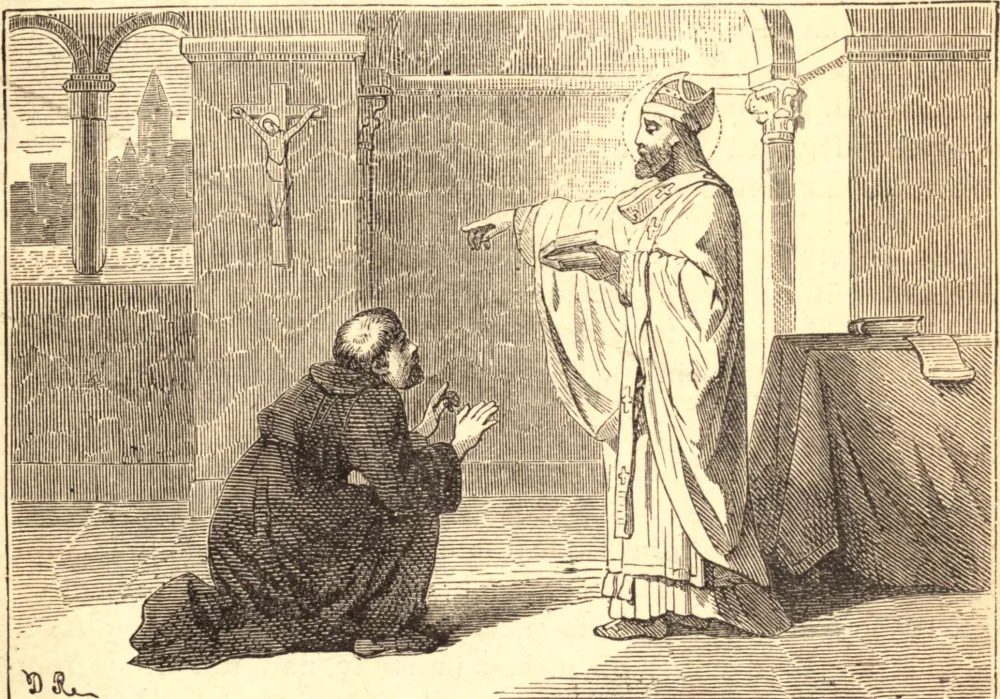

# 3 de abril — SÃO RICARDO DE CHICHESTER

RICARDO nasceu, em 1197, na pequena cidade de Wyche, a oito milhas de Worcester, na Inglaterra. Ele e seu irmão mais velho ficaram órfãos quando jovens, e Ricardo abandonou os estudos que tanto amava, para cultivar a propriedade empobrecida de seu irmão. Seu irmão, em gratidão pelo bem-sucedido cuidado de Ricardo, propôs-se a transferir-lhe todas as suas terras; mas ele recusou tanto a propriedade como a oferta de um brilhante casamento, para estudar para o sacerdócio em Oxford. Em 1235 foi nomeado, por seu saber e sua piedade, chanceler daquela Universidade, e depois, por Santo Edmundo de Cantuária, chanceler de sua diocese. Pôs-se ao lado daquele Santo em sua longa contenda com o rei, e acompanhou-o ao exílio. Após a morte de Santo Edmundo, Ricardo regressou à Inglaterra para labutar como simples cura, mas logo foi eleito Bispo de Chichester, de preferência ao indigno nomeado de Henrique III. O rei, em vingança, recusou-se a reconhecer a eleição, e apoderou-se das rendas da sé. Assim, Ricardo viu-se travando a mesma batalha em que Santo Edmundo havia morrido. Foi a Lião, ali foi consagrado por Inocêncio IV em 1245, e, regressando à Inglaterra, apesar de sua pobreza e da hostilidade do rei, exerceu plenamente seus direitos episcopais, e reformou inteiramente sua sé. Após dois anos, suas rendas foram restituídas. Jovens e velhos amavam São Ricardo. Dava tudo o que tinha, e operava milagres, para alimentar os pobres e curar os enfermos; mas, quando estavam em jogo os direitos ou a pureza da Igreja, ele era inexorável. Um sacerdote de sangue nobre maculou seu ofício com o pecado; Ricardo privou-o de seu benefício, e recusou a petição do rei em seu favor. Por outro lado, quando um cavaleiro pôs violentamente um sacerdote na prisão, Ricardo compeliu o cavaleiro a dar a volta à igreja do sacerdote com o mesmo madeiro ao pescoço ao qual havia acorrentado o sacerdote; e, quando os burgueses de Lewes arrancaram um criminoso da igreja e o enforcaram, Ricardo fê-los desenterrar o corpo de sua sepultura não consagrada, e levá-lo de volta ao santuário que haviam violado. Ricardo morreu em 1253, enquanto pregava, por ordem do Papa, uma cruzada contra os sarracenos.

## Reflexão

Como irmão, como chanceler e como bispo, São Ricardo cumpriu fielmente cada dever de seu estado sem um pensamento sequer em seus próprios interesses. A negligência do dever é o primeiro sinal daquele amor-próprio que termina com a perda da graça.
