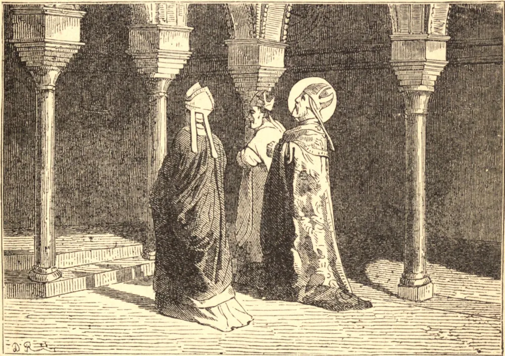

# 4 de abril — SANTO ISIDORO, Arcebispo

ISIDORO nasceu de uma família ducal, em Cartagena, na Espanha. Seus dois irmãos, Leandro, Arcebispo de Sevilha, Fulgêncio, Bispo de Écija, e sua irmã Florentina, são Santos. Quando menino, desesperou-se ante seu mau êxito nos estudos, e fugiu da escola. Descansando em sua fuga junto a uma fonte à beira do caminho, observou uma pedra, que fora escavada pelo gotejar da água. Isto o decidiu a voltar, e, por aplicação esforçada, conseguiu onde havia fracassado. Voltou ao seu mestre, e, com o auxílio de Deus, tornou-se, ainda jovem, um dos homens mais doutos de seu tempo. Auxiliou na conversão do Príncipe Recaredo, o chefe do partido ariano; e, com sua ajuda, embora com constante perigo da própria vida, expulsou aquela heresia da Espanha. Então, seguindo um chamado de Deus, fez-se surdo às súplicas de seus amigos, e abraçou a vida de eremita. O Príncipe Recaredo e muitos dos nobres e do clero de Sevilha foram persuadi-lo a sair, e representaram-lhe as necessidades dos tempos, e o bem que poderia fazer, e que já fizera, entre o povo. Ele recusou, e, tanto quanto podemos julgar, essa recusa deu-lhe a oportunidade necessária de adquirir a virtude e o poder que mais tarde fizeram dele um ilustre Bispo e Doutor da Igreja. Com a morte de seu irmão Leandro, foi chamado a ocupar a sé vacante. Como mestre, governante, fundador e reformador, labutou não só em sua própria diocese, mas por toda a Espanha, e até em países estrangeiros. Morreu em Sevilha no dia 4 de abril de 636, e, dentro de dezesseis anos após sua morte, foi declarado Doutor da Igreja Católica.

## Reflexão

A força da tentação reside geralmente no fato de que seu objeto é algo lisonjeiro ao nosso orgulho, suavizante à nossa preguiça, ou de algum modo atraente às paixões mais baixas. Santo Isidoro ensina-nos a não escutar nem os impulsos da natureza nem o plausível conselho dos amigos, quando contradizem a voz de Deus.
