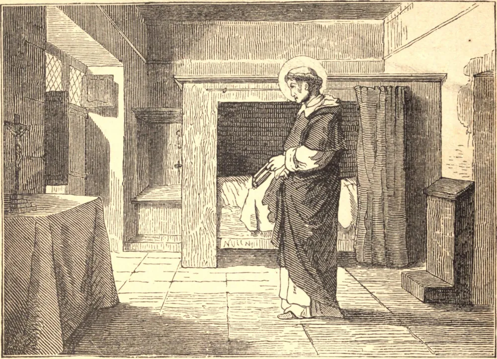

# 5 de abril — SÃO VICENTE FERRER

O ADMIRÁVEL apóstolo de Cristo, o "Anjo do Juízo", nasceu em Valência, na Espanha, em 1350, e aos dezoito anos professou na Ordem de São Domingos. Após um brilhante curso de estudos, tornou-se mestre em sagrada teologia. Por três anos leu somente as Escrituras, e sabia de cor toda a Bíblia. Converteu os judeus de Valência, e sua sinagoga tornou-se uma igreja.

A dor pelo grande cisma que então afligia a Igreja reduziu-o à beira da morte; mas o próprio Nosso Senhor, em glória, ordenou-lhe que saísse a converter os pecadores, "porque o Meu juízo está próximo." Este miraculoso apostolado durou vinte e um anos. Pregou por toda a Europa, nas cidades e aldeias da Espanha, Suíça, França, Itália, Inglaterra, Irlanda, Escócia. Por toda parte dezenas de milhares de pecadores se emendaram; judeus, infiéis e hereges foram convertidos. Estupendos milagres davam força às suas palavras. Duas vezes por dia o "sino dos milagres" convocava os enfermos, os cegos, os coxos a serem curados. Os pecadores mais obstinados tornavam-se Santos; falando apenas seu castelhano natal, era entendido em todas as línguas. Procissões de dez mil penitentes seguiam-no em perfeita ordem. Conventos, orfanatos, hospitais erguiam-se em seu caminho. Em meio a tudo, sua humildade permanecia profunda, sua oração constante. Sempre se preparava para a pregação pela oração.

Certa vez, porém, quando uma pessoa de alta hierarquia haveria de estar presente em seu sermão, ele negligenciou a oração em favor do estudo. O nobre não se impressionou particularmente com o discurso que assim fora cuidadosamente elaborado; mas, vindo de novo ouvir o Santo, sem que este o soubesse, o segundo sermão causou profunda impressão em sua alma. Quando São Vicente ouviu falar da diferença, observou que, no primeiro sermão, fora Vicente quem havia pregado, mas no segundo, Jesus Cristo.

Adoeceu em Vannes, na Bretanha, e recebeu a coroa da glória eterna em 1419.

**Reflexão**—"Faças o que fizeres", dizia São Vicente, "não penses em ti mesmo, mas em Deus." Neste espírito ele pregava, e Deus falava por ele; neste espírito, se escutarmos, ouviremos a voz de Deus.
