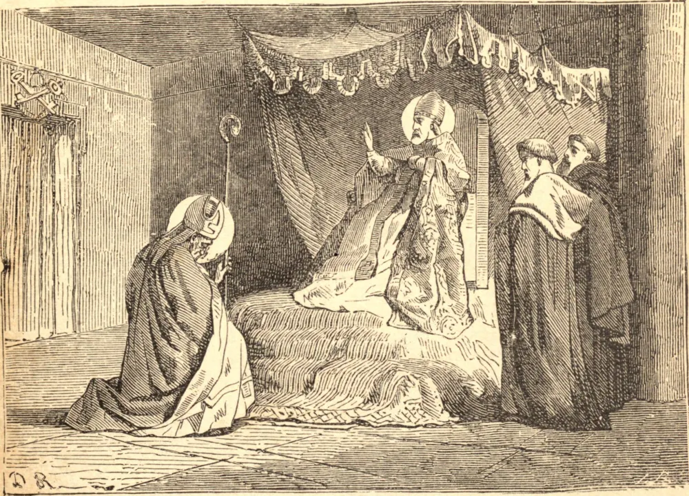

# 6 de abril — SÃO CELESTINO, Papa

SÃO CELESTINO era natural de Roma, e, ao falecer o Papa Bonifácio, foi escolhido para sucedê-lo, em setembro de 422, pelo admirável consentimento de toda a cidade. Seu primeiro ato oficial foi confirmar a condenação de um bispo africano que havia sido convencido de graves crimes. Escreveu também aos bispos das províncias de Vienne e de Narbona, na Gália, para corrigir vários abusos, e ordenou, entre outras coisas, que a absolvição ou reconciliação jamais fosse recusada a qualquer pecador moribundo que sinceramente a pedisse; pois o arrependimento depende não tanto do tempo quanto do coração.

Reuniu um sínodo em Roma no ano de 430, no qual os escritos de Nestório foram examinados, e suas blasfêmias, em sustentar em Cristo uma pessoa divina e uma humana, foram condenadas. O Papa pronunciou sentença de excomunhão contra Nestório, e o depôs.

Sendo informado de que Agrícola, filho de um bispo britânico chamado Saveriano, que havia sido casado antes de ser elevado ao sacerdócio, havia espalhado as sementes da heresia pelagiana na Grã-Bretanha, São Celestino para lá enviou São Germano de Auxerre, cujo zelo e cuja conduta felizmente impediram o perigo iminente. Enviou também São Paládio, um romano, a pregar a Fé aos escotos, tanto na Grã-Bretanha do Norte como na Irlanda, e muitos autores da vida de São Patrício afirmam que aquele apóstolo igualmente recebeu de São Celestino sua missão de pregar aos irlandeses, em 431.

Este santo Papa morreu no dia 1º de agosto de 432, tendo reinado quase dez anos.

**Reflexão**—A vigilância é verdadeiramente necessária àqueles a quem foi confiado o cuidado das almas. "Bem-aventurados os servos que o Senhor, ao chegar, encontrar vigilantes."
