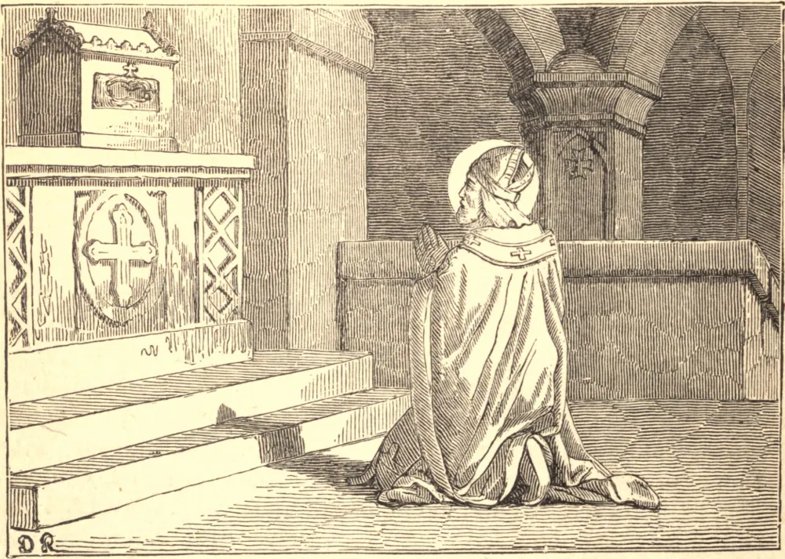

# 8 de abril — SÃO PERPÉTUO, Bispo

SÃO PERPÉTUO foi o oitavo Bispo de Tours a partir de São Gaciano, e governou aquela sé por mais de trinta anos, de 461 a 491, quando morreu no dia 8 de abril. Durante todo esse tempo trabalhou, por meio de zelosos sermões, muitos sínodos e salutares regulamentos, para conduzir as almas à virtude.

São Perpétuo tinha grande veneração pelos Santos, e respeito por suas relíquias, adornava seus santuários e enriquecia suas igrejas. Como havia uma contínua sucessão de milagres no túmulo de São Martinho, Perpétuo, achando demasiado pequena para a afluência de povo que para lá acorria a igreja construída por São Brício, mandou ampliá-la. Quando o edifício ficou concluído, o bom bispo solenizou a dedicação desta nova igreja e realizou a trasladação do corpo de São Martinho, no dia 4 de julho de 473.

Nosso Santo fez e assinou seu testamento, que ainda existe, no dia 1 de março de 475, quinze anos antes de sua morte. Por ele perdoa todas as dívidas que lhe eram devidas; e, tendo legado à sua igreja a sua biblioteca e várias herdades, e estabelecido um fundo para a manutenção das lâmpadas e a compra de vasos sagrados, conforme a ocasião o exigisse, declara os pobres seus herdeiros. Acrescenta as mais comoventes exortações à concórdia e à piedade; e lega à sua irmã, Fídia Júlia Perpétua, uma pequena cruz de ouro, com relíquias; deixa legados a vários outros amigos e sacerdotes, pedindo a cada um que se lembre dele em suas orações. Seu antigo epitáfio iguala-o ao grande São Martinho.

**Reflexão**—A dor da pobreza, diz um escritor espiritual, é aliviada mais ainda por uma palavra de verdadeira simpatia do que pela esmola que damos. A esmola dada com frieza e aspereza irrita em vez de aliviar. Mesmo quando não podemos dar, as palavras de bondade são como um bálsamo precioso; e quando podemos dar, são elas o sal e o tempero de nossas esmolas.
