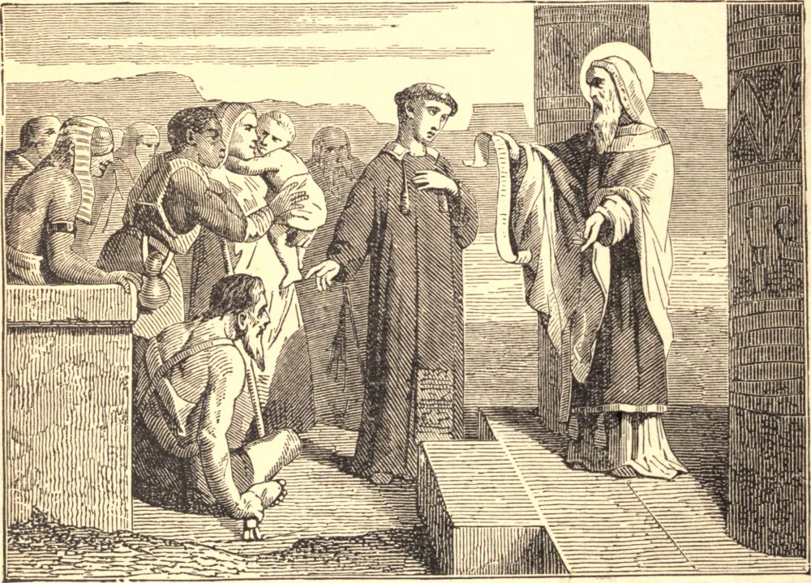

# 9 de abril — SÃO JOÃO, O ESMOLER

SÃO JOÃO era casado, mas, quando sua esposa e seus dois filhos morreram, considerou aquilo um chamado de Deus para levar uma vida perfeita. Começou a dar em esmolas tudo quanto possuía, e ficou conhecido por todo o Oriente como o Esmoler. Foi nomeado Patriarca de Alexandria; mas, antes de tomar posse de sua sé, disse a seus servos que percorressem a cidade e lhe trouxessem uma lista de seus senhores — querendo dizer os pobres. Trouxeram-lhe a notícia de que havia sete mil e quinhentos deles, e a estes ele se incumbiu de alimentar todos os dias.

Na quarta e na sexta-feira de cada semana, sentava-se num banco diante da igreja, para ouvir as queixas dos necessitados e dos agravados; nem permitia que seus servos provassem alimento até que se reparassem os agravos. O temor da morte estava sempre diante dele, e nunca proferia uma palavra ociosa. Expulsava da igreja aqueles que via conversando, e proibia todos os detratores de entrar em sua casa. Deixou em Alexandria setenta igrejas, onde havia encontrado apenas sete.

Um mercador recebeu de São João cinco libras de peso em ouro para comprar mercadorias. Tendo sofrido naufrágio e perdido tudo, recorreu novamente a João, que disse: "Parte de tua mercadoria foi mal adquirida", e deu-lhe mais dez libras; mas na viagem seguinte perdeu tanto o navio quanto os bens. Disse então João: "O navio foi adquirido injustamente. Toma quinze libras de ouro, compra trigo com elas, e põe-no num de meus navios." Desta vez o mercador foi levado pelos ventos, sem o saber, até a Inglaterra, onde havia uma fome; e vendeu o trigo pelo seu peso em estanho, e ao regressar achou o estanho transformado na mais fina prata. São João morreu em Chipre, sua terra natal, por volta do ano de 619.

**Reflexão**—Que sacrifícios podemos fazer pelos pobres que pareçam suficientes, quando refletimos que a misericórdia para com eles é o nosso único meio de retribuir a Jesus Cristo, que sacrificou Sua vida por nós?
