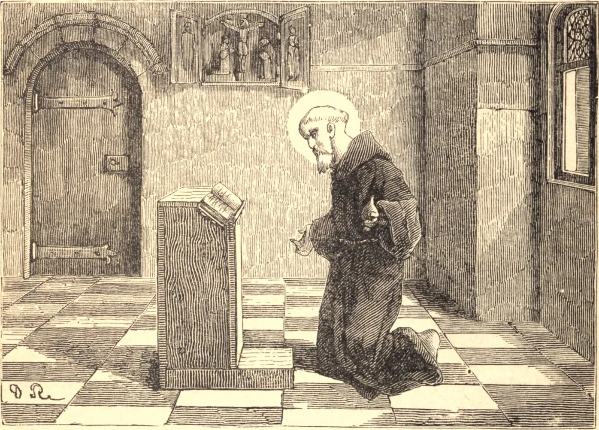

# 10 de abril — SÃO BADEMO, Mártir

BADEMO era um rico e nobre cidadão de Betlapeta, na Pérsia, que fundou um mosteiro perto daquela cidade, o qual governou com grande santidade. Conduzia seus religiosos pelas sendas da perfeição com doçura, prudência e caridade. Para coroar sua virtude, Deus permitiu que ele, com sete de seus monges, fosse preso pelos sequazes do Rei Sapor, no trigésimo sexto ano de sua perseguição. Jazeu quatro meses num calabouço, carregado de cadeias, durante cujo prolongado martírio recebia todos os dias uma porção de açoites. Mas triunfou sobre seus tormentos pela paciência e alegria com que os sofria por Cristo.

Ao mesmo tempo, um senhor cristão chamado Nersan, Príncipe da Aria, foi lançado na prisão por se recusar a adorar o sol. A princípio mostrou alguma resolução; mas, à vista dos tormentos, faltou-lhe a constância, e prometeu submeter-se. O rei, para provar se sua mudança era sincera, ordenou que Bademo fosse introduzido na prisão de Nersan, que era um aposento do palácio real, e mandou dizer a Nersan que, se ele matasse Bademo, seria restituído à sua liberdade e às suas antigas dignidades. O miserável aceitou a condição; puseram-lhe uma espada na mão, e avançou para cravá-la no peito do abade. Mas, tomado de súbito terror, deteve-se, e permaneceu algum tempo sem conseguir erguer o braço para golpear. Não tinha nem coragem para se arrepender, nem ânimo para consumar seu crime. Esforçou-se, contudo, por endurecer-se, e continuou, com a mão trêmula, a apontar para os flancos do mártir. O medo, a vergonha, o remorso e o respeito pelo mártir tornavam seus golpes fracos e inseguros; e foi tão grande o número de feridas do mártir, que os circunstantes ficavam admirados de sua invencível paciência. Após quatro golpes, a cabeça do mártir foi separada do tronco.

Nersan, pouco tempo depois, caindo em desgraça pública, pereceu pela espada. O corpo de São Bademo foi lançado ignominiosamente para fora da cidade pelos infiéis, mas foi secretamente levado e sepultado pelos cristãos. Seus discípulos foram libertados de suas cadeias quatro anos depois, com a morte do Rei Sapor. São Bademo padeceu no dia 10 de abril do ano de 376.

**Reflexão**—Oh! que arrebatadoras delícias prova a alma que está acostumada, por um hábito familiar, a conversar no céu de seu próprio interior com as Três Pessoas da adorável Trindade! Os mundanos admiram-se de como os santos solitários podem passar todo o seu tempo sepultados na mais profunda solidão e silêncio. Mas aqueles que tiveram alguma experiência desta felicidade espantam-se, com razão muito maior, de como é possível que quaisquer almas, que foram criadas para conversar eternamente com Deus, vivam aqui em constante dissipação, raramente acolhendo um pensamento devoto Daquele cujos encantos e doce conversa eternamente arrebatam todos os bem-aventurados.
