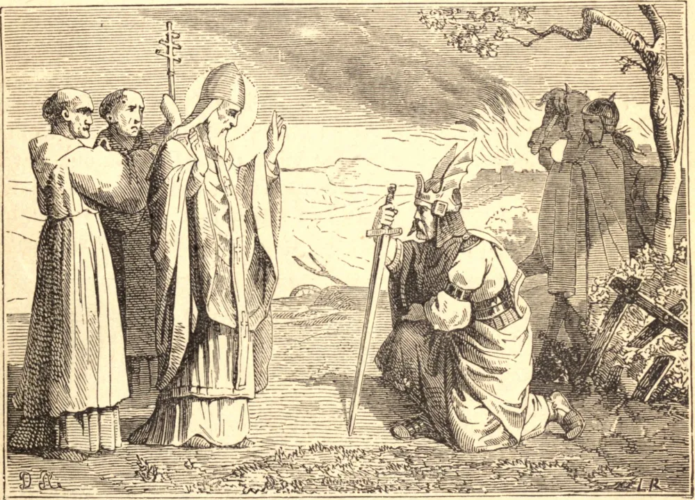

# 11 de abril — SÃO LEÃO MAGNO

LEÃO nasceu em Roma. Abraçou o sagrado ministério, foi feito arquidiácono da Igreja Romana por São Celestino, e sob ele e sob Sisto III teve grande parte no governo da Igreja. À morte de Sisto, Leão foi escolhido Papa, e consagrado no dia de São Miguel, em 440, em meio a grande alegria. Era um tempo de terrível provação. Os vândalos e os hunos devastavam as províncias do império, e os nestorianos, os pelagianos e outros hereges causavam estragos ainda mais graves entre as almas. Enquanto o zelo de Leão fazia frente a esses perigos, surgiu a nova heresia de Êutiques, que confundia as duas naturezas de Cristo. Imediatamente o vigilante pastor proclamou a verdadeira doutrina da Encarnação em seu famoso "tomo"; mas, fomentada pela corte bizantina, a heresia ganhou forte arraigamento entre os monges e bispos do Oriente. Após três anos de incessante labor, Leão promoveu sua solene condenação pelo Concílio de Calcedônia, assinando os Padres todos o seu tomo e exclamando: "Pedro falou por Leão." Pouco depois, Átila com seus hunos irrompeu na Itália, e marchou através de suas cidades em chamas sobre Roma. Leão saiu corajosamente ao seu encontro, e o persuadiu a voltar atrás. Espantados de ver o terrível Átila, o "Flagelo de Deus", recém-saído do saque de Aquileia, Milão e Pavia, com o rico despojo de Roma ao seu alcance, fazer recuar seu grande exército até o Danúbio à palavra do Santo, seus chefes perguntaram-lhe por que agira tão estranhamente. Respondeu que vira duas personagens veneráveis, supostas serem São Pedro e São Paulo, postadas atrás de Leão, e, impressionado por esta visão, retirou-se. Se os perigos da Igreja são tão grandes agora como nos dias de São Leão, não é menor a solicitude de São Pedro. Dois anos depois a cidade caiu presa dos vândalos; mas mesmo então Leão salvou-a da destruição. Morreu no ano de 461, tendo governado a Igreja por vinte anos.

## Reflexão

Leão amava atribuir todos os frutos de seus incansáveis trabalhos ao glorioso chefe dos apóstolos, que, segundo muitas vezes declarava, vive e governa em seus sucessores.
