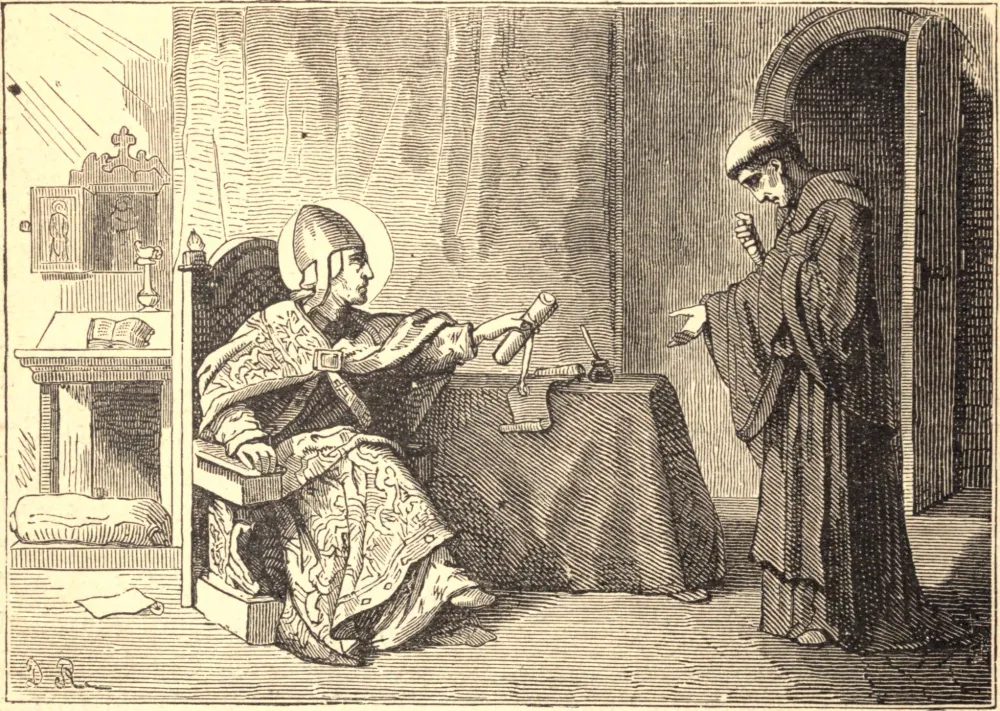

# 12 de abril — SÃO JÚLIO, Papa

SÃO JÚLIO era romano, e foi escolhido Papa no dia 6 de fevereiro de 337. Os bispos arianos do Oriente enviaram-lhe três delegados para acusar Santo Atanásio, o zeloso Patriarca de Alexandria. Estas acusações, como a ordem da justiça exigia, Júlio comunicou-as a Atanásio, que por isso enviou seus delegados a Roma; e então, após uma audiência imparcial, os advogados dos hereges ficaram confundidos e silenciados em todos os artigos de sua acusação.

Os arianos pediram então um concílio, e o Papa reuniu um em Roma em 341. Os arianos, em vez de comparecer, realizaram um pretenso concílio em Antioquia em 341, no qual presumiram nomear um certo Gregório, ímpio ariano, Bispo de Alexandria, retiveram os legados do Papa além do tempo marcado para o seu comparecimento; e então escreveram a Sua Santidade, alegando uma pretensa impossibilidade de comparecerem, por causa da guerra persa e de outros impedimentos. O Papa facilmente percebeu estes pretextos, e num concílio em Roma examinou a causa de Santo Atanásio, declarou-o inocente das coisas que lhe imputavam os arianos, e confirmou-o em sua sé. Absolveu também Marcelo de Ancira, mediante sua ortodoxa profissão de fé. Redigiu e enviou, pelo Conde Gabiano, aos bispos eusebianos do Oriente, que primeiro haviam pedido um concílio e depois se recusaram a comparecer a ele, uma excelente carta, que é tida como um dos mais belos monumentos da antiguidade eclesiástica.

Achando os eusebianos ainda obstinados, moveu Constante, Imperador do Ocidente, a exigir o concurso de seu irmão Constâncio na reunião de um concílio geral em Sárdica, na Ilíria. Este foi aberto em maio de 347, e declarou ortodoxos e inocentes Santo Atanásio e Marcelo de Ancira, depôs certos bispos arianos, e formulou vinte e um cânones de disciplina. São Júlio reinou quinze anos, dois meses e seis dias, morrendo no dia 12 de abril de 352.
