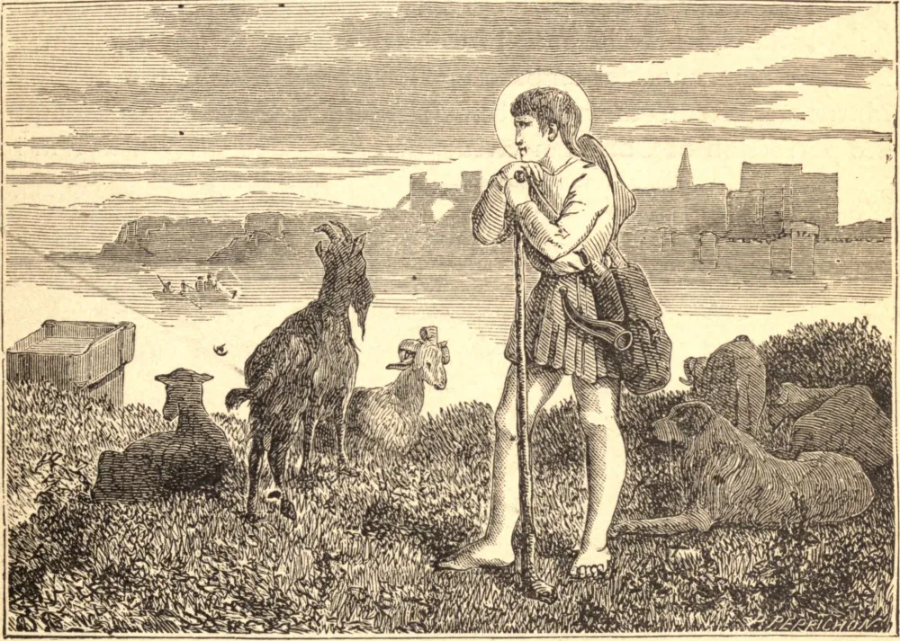

# 14 de abril — SÃO BENEZET, ou o Pequeno Bennet

SÃO BENEZET guardava as ovelhas de sua mãe no campo, e, sendo ainda mera criança, era devotado às práticas de piedade. Como muitas pessoas se afogavam ao atravessar o Ródano, Benezet foi inspirado por Deus a construir uma ponte sobre esse rápido rio em Avinhão. Obteve a aprovação do bispo, comprovou sua missão por milagres, e começou a obra em 1177, a qual dirigiu durante sete anos. Morreu quando a dificuldade do empreendimento havia passado, em 1184. Isto é atestado por monumentos públicos lavrados naquele tempo e ainda conservados em Avinhão, onde a história está na boca de todos.

Seu corpo foi sepultado sobre a própria ponte, que só ficou inteiramente concluída quatro anos após o seu falecimento, sendo a sua construção acompanhada de milagres desde o primeiro assentamento das fundações até ser completada em 1188. Outros milagres operados depois disso em seu túmulo induziram a cidade a construir uma capela sobre a ponte, na qual o seu corpo jazeu por quase quinhentos anos. Mas, em 1669, desmoronando-se a maior parte da ponte pela impetuosidade das águas, o caixão foi recolhido, e, sendo aberto em 1670 na presença do grão-vigário, durante a vacância da sé arquiepiscopal, achou-se o corpo inteiro, sem o menor sinal de corrupção; até as entranhas estavam perfeitamente sãs, e a cor dos olhos viva e animada, embora, pela umidade do local, as barras de ferro em torno do caixão estivessem muito danificadas pela ferrugem.

O corpo foi encontrado na mesma condição pelo Arcebispo de Avinhão em 1674, quando, acompanhado do Bispo de Orange e de grande concurso da nobreza, realizou a sua trasladação, com grande pompa, para a Igreja dos Celestinos, tendo esta Ordem obtido de Luís XIV a honra de ser-lhe confiada a custódia de suas relíquias até o tempo em que a ponte e a capela fossem reconstruídas.

**Reflexão**—Oremos pela perseverança nas boas obras. Santo Agostinho diz: "Quando os Santos oram com as palavras que Cristo ensinou, pouco mais pedem do que o dom da perseverança."
