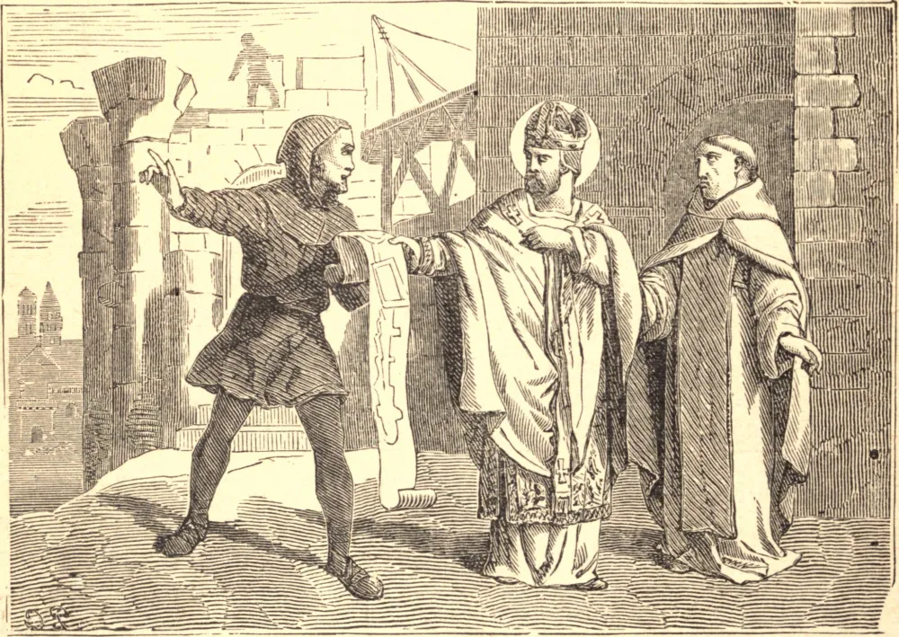

# 15 de abril — SÃO PATERNO, Bispo

SÃO PATERNO nasceu em Poitiers, por volta do ano de 482. Seu pai, Patrano, com o consentimento de sua esposa, foi para a Irlanda, onde terminou seus dias em santa solidão. Paterno, inflamado por seu exemplo, abraçou a vida monástica na abadia de Marnes. Depois de algum tempo, ardendo no desejo de alcançar a perfeição da virtude cristã, passou ao País de Gales, e em Cardiganshire fundou um mosteiro chamado Llan-patern-vaur, ou a igreja do grande Paterno.

Fez uma visita a seu pai na Irlanda, mas, sendo chamado de volta ao seu mosteiro de Marnes, retirou-se pouco depois com São Escubilião, monge daquela casa, e abraçou uma austera vida anacorética nas florestas de Scicy, na diocese de Coutances, junto ao mar, tendo primeiro obtido licença do bispo e do senhor do lugar. Este deserto, que então era de grande extensão, mas que desde então foi sendo gradualmente tomado pelo mar, era antigamente de grande prestígio entre os druidas.

São Paterno converteu à fé os idólatras daquela e de muitas regiões vizinhas, até Bayeux, e persuadiu-os a demolir um templo pagão neste deserto, que era tido em grande veneração pelos antigos gauleses. Em sua velhice foi consagrado Bispo de Avranches por Germano, Bispo de Ruão.

Tendo alguns falsos irmãos criado uma divisão de opiniões entre os bispos da província a respeito de São Paterno, ele preferiu retirar-se a dar qualquer motivo de dissensão, e, depois de governar sua diocese por treze anos, recolheu-se a uma solidão na França, e ali terminou seus dias por volta do ano de 550.

**Reflexão**—Os maiores sacrifícios impostos pelo amor da paz parecerão coisa nenhuma se chamarmos à memória o exemplo de Nosso Salvador, e nos lembrarmos de Suas palavras: "Bem-aventurados os pacíficos, porque serão chamados filhos de Deus."
