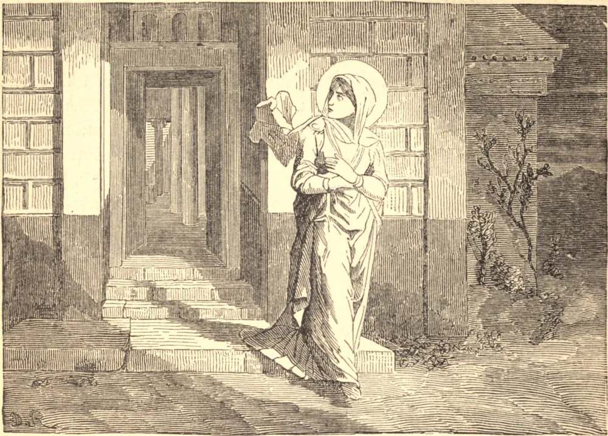

# 16 de abril — DEZOITO MÁRTIRES DE SARAGOÇA, e SANTA ÊNCRATIS, ou ENGRÁCIA, Virgem, Mártir

SÃO OPTATO e outros dezessete santos homens receberam a coroa do martírio no mesmo dia, em Saragoça, sob o cruel Governador Daciano, na perseguição de Diocleciano, em 304. Outros dois, Caio e Crementino, morreram de seus tormentos após um segundo combate.

A Igreja celebra também neste dia o triunfo de Santa Êncratis, ou Engrácia, Virgem. Era natural de Portugal. Seu pai havia-a prometido em casamento a um homem de qualidade no Rossilhão; mas, temendo os perigos e desprezando as vaidades do mundo, e resolvendo conservar a sua virgindade, a fim de aparecer mais agradável ao seu Esposo celestial e servi-Lo sem estorvo, fugiu da casa de seu pai e refugiou-se secretamente em Saragoça, onde a perseguição era mais ardente, sob os olhos de Daciano. Chegou mesmo a censurá-lo por suas barbaridades, ante o que ele ordenou que ela fosse longamente atormentada do modo mais desumano: seus flancos foram rasgados com ganchos de ferro, e um de seus seios foi cortado, de modo que as partes internas de seu peito ficaram expostas à vista, e parte de seu fígado foi arrancada. Nesta condição foi reconduzida à prisão, ainda viva, e morreu pela gangrena de suas feridas, em 304. As relíquias de todos estes mártires foram encontradas em Saragoça em 1389.

## Reflexão

Os homens não buscam os bens temporais ao acaso, nem por arrancos. Sejamos igualmente pontuais e ordenados no serviço de Deus, não andando à procura de novos caminhos, mas aperfeiçoando as nossas devoções ordinárias. Se nelas perseverarmos, o Paraíso é nosso.
