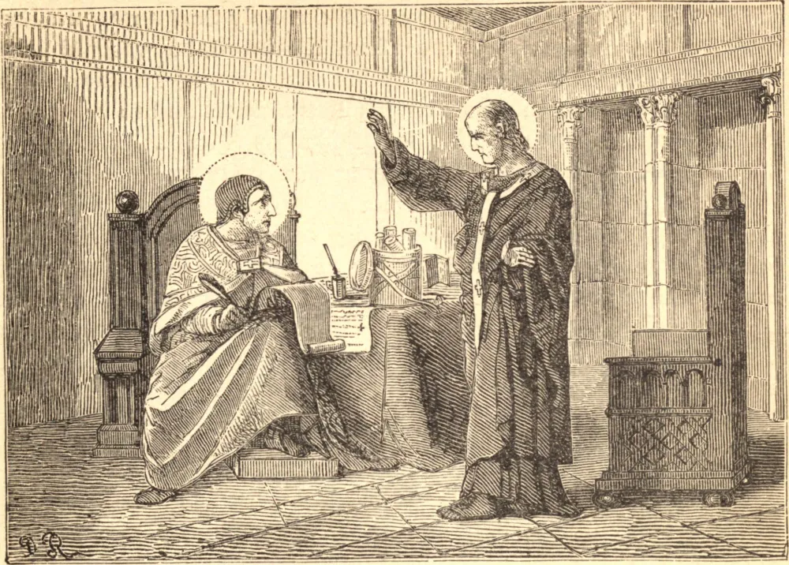

# 17 de abril — SANTO ANICETO, Papa, Mártir

SANTO ANICETO sucedeu a São Pio e ocupou a cátedra por cerca de oito anos, de 165 a 173. Se não derramou seu sangue pela Fé, ao menos adquiriu o título de mártir por grandes sofrimentos e perigos. Recebeu a visita de São Policarpo e tolerou o costume dos asiáticos de celebrar a Páscoa no 14º dia da primeira lua após o equinócio vernal, juntamente com os judeus. Sua vigilância protegeu seu rebanho das astúcias dos hereges Valentim e Marcião, que procuravam corromper a fé na capital do mundo.

Os primeiros trinta e seis bispos de Roma, até Libério, e, excetuado este, todos os papas até Símaco, o quinquagésimo segundo, em 498, são honrados entre os Santos; e de duzentos e quarenta e oito papas, de São Pedro até Clemente XIII, setenta e oito são nomeados no Martirológio Romano.

Nas idades primitivas, o espírito de fervor e perfeita santidade, que hoje em dia tão raramente se encontra, era manifesto na maioria dos fiéis, e especialmente em seus pastores. Todo o teor de suas vidas o respirava de tal maneira que os tornava os milagres do mundo, anjos sobre a terra, cópias vivas de seu divino Redentor, cujo odor de virtudes, santa lei e religião espalhavam por todos os lados.

**Reflexão**—Se, depois de fazer os mais solenes protestos de inviolável amizade e afeição por um semelhante, no momento seguinte o injuriássemos e o desprezássemos, sem termos recebido qualquer provocação ou afronta, e isto habitualmente, não chamaria o mundo inteiro, com justiça, nossos protestos de hipocrisia e nossa pretensa amizade de zombaria? Julguemos por esta regra se nosso amor de Deus é soberano, enquanto nossa inconstância trai a insinceridade de nossos corações.
