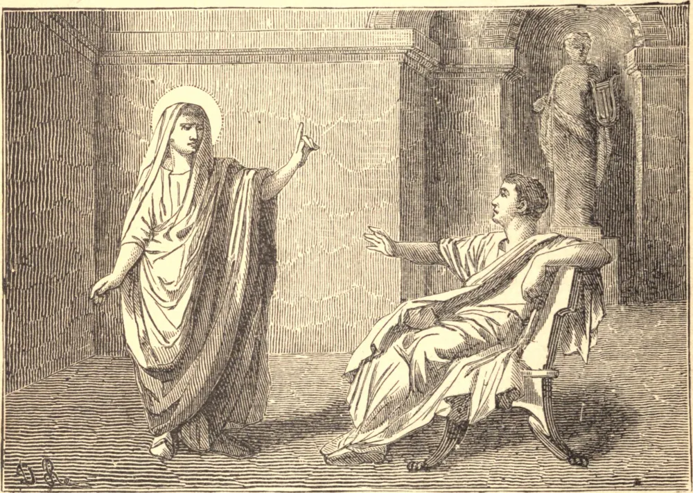

# 18 de abril — SANTO APOLÔNIO, Mártir

MARCO AURÉLIO havia perseguido os cristãos, mas seu filho Cômodo, que em 180 lhe sucedeu, mostrou-se favorável a eles por consideração à sua imperatriz Márcia, que era admiradora da Fé. Durante esta calmaria, o número dos fiéis cresceu enormemente, e muitas pessoas de primeira ordem, entre elas Apolônio, um senador romano, alistaram-se sob o estandarte da cruz. Era pessoa muito versada tanto na filosofia quanto na Sagrada Escritura. Em meio à paz de que a Igreja gozava, foi publicamente acusado de cristianismo por um de seus próprios escravos. O escravo foi imediatamente condenado a ter as pernas quebradas e a ser morto, em consequência de um édito de Marco Aurélio que, sem revogar as leis anteriores contra os cristãos condenados, ordenava por ele que seus acusadores fossem mortos. Executado o escravo, o mesmo juiz enviou uma ordem a Santo Apolônio para que renunciasse à sua religião, se prezava sua vida e sua fortuna. O Santo corajosamente rejeitou tão ignominiosas condições de segurança, pelo que Perênis o remeteu ao julgamento do senado romano, para que prestasse conta de sua fé àquele corpo. Persistindo em sua recusa de cumprir a condição, o Santo foi condenado por um decreto do Senado e decapitado por volta do ano 186.

## Reflexão

É prerrogativa da religião cristã inspirar nos homens tal resolução, e formá-los a tal heroísmo, que se regozijam de sacrificar a vida pela verdade. Isto não é a simples força e o esforço da natureza, mas o indubitável poder do Todo-Poderoso, cuja força assim se aperfeiçoa na fraqueza. Todo cristão deveria, por seu modo de viver, dar testemunho da santidade de sua fé. Tal seria a força do bom exemplo universal, que nenhum libertino ou infiel poderia resistir-lhe.
