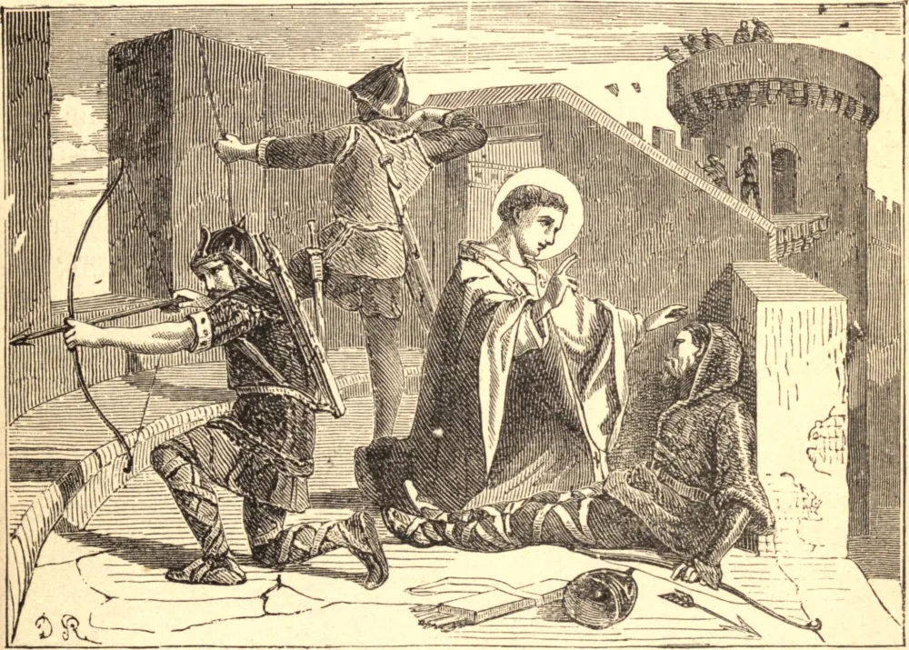

# 19 de abril — SANTO ELFEGO, Arcebispo

SANTO ELFEGO nasceu no ano de 954, de uma nobre família saxã. Tornou-se primeiro monge no mosteiro de Deerhurst, perto de Tewkesbury, na Inglaterra, e depois viveu como eremita perto de Bath, onde fundou uma comunidade sob a regra de São Bento e se tornou seu primeiro abade. Aos trinta anos de idade foi escolhido Bispo de Winchester, e vinte e dois anos mais tarde tornou-se Arcebispo de Cantuária. Em 1011, quando os dinamarqueses desembarcaram em Kent e tomaram a cidade de Cantuária, entregando tudo ao fogo e à espada, Santo Elfego foi capturado e levado na expectativa de um grande resgate. Não queria que sua igreja arruinada e seu povo fossem submetidos a tal despesa, e foi mantido numa prisão imunda em Greenwich por sete meses. Enquanto estava ali confinado, alguns amigos vieram e o instaram a lançar um imposto sobre seus rendeiros para reunir a soma exigida por seu resgate. "Que recompensa posso eu esperar", disse ele, "se gastar comigo mesmo o que pertence aos pobres? Melhor dar aos pobres o que é nosso, do que tomar deles o pouco que é seu." Como ainda se recusasse a dar resgate, os dinamarqueses, enfurecidos, lançaram-se sobre ele com fúria, espancaram-no com os lados cegos de suas armas e o feriram com pedras, até que um, a quem o Santo havia batizado pouco antes, pôs fim a seus sofrimentos com o golpe de um machado. Morreu no Sábado de Páscoa, 19 de abril de 1012, sendo suas últimas palavras uma oração por seus assassinos. Seu corpo foi primeiramente sepultado em São Paulo, em Londres, mas foi depois trasladado para Cantuária pelo rei Canuto. Uma igreja dedicada a Santo Elfego ainda se ergue no lugar de seu martírio, em Greenwich.

## Reflexão

Aqueles que ocupam altas posições devem considerar-se mais administradores do que senhores da riqueza ou do poder a eles confiados para o benefício dos pobres e fracos. Santo Elfego preferiu morrer a extorquir seu resgate dos pobres rendeiros das terras da Igreja.
