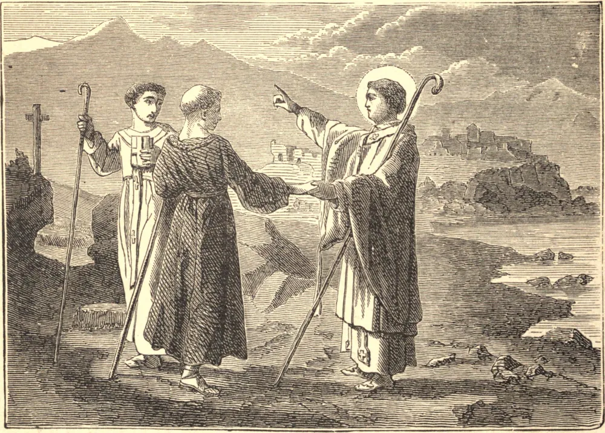

# 20 de abril — SÃO MARCELINO, Bispo

SÃO MARCELINO nasceu na África, de família nobre; acompanhado por Vicente e Domnino, passou para a Gália, e ali pregou o Evangelho, com grande sucesso, nas vizinhanças dos Alpes.

Depois fixou-se em Embrun, onde construiu uma capela na qual passava as noites em oração, após trabalhar o dia inteiro no exercício de sua sagrada vocação. Por seu piedoso exemplo, bem como por suas palavras fervorosas, converteu muitos dos pagãos entre os quais vivia. Foi depois feito bispo do povo que havia ganho para Cristo, mas a data de sua consagração não é positivamente conhecida.

Ardendo de zelo pela glória de Deus, enviou Vicente e Domnino a pregar a fé naquelas partes que não podia visitar em pessoa. Morreu em Embrun por volta do ano 374, e ali foi sepultado. São Gregório de Tours, que fala de Marcelino em termos do mais alto louvor, menciona muitos milagres acontecidos em seu túmulo.

**Reflexão**—Embora possais não ser chamados a pregar, ao menos esforçai-vos por dar bom exemplo, lembrando-vos de que as obras falam muitas vezes mais alto do que as palavras.
