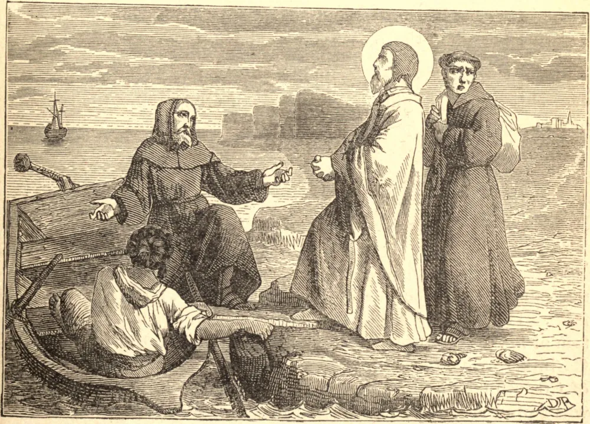

# 21 de abril — SANTO ANSELMO, Arcebispo

ANSELMO era natural do Piemonte. Quando menino de quinze anos, sendo-lhe proibido entrar na vida religiosa, perdeu por algum tempo o fervor, deixou seu lar e frequentou diversas escolas na França. Por fim sua vocação reviveu, e tornou-se monge em Bec, na Normandia.

A fama de sua santidade neste claustro levou Guilherme Rufo, quando perigosamente enfermo, a tomá-lo por seu confessor e a nomeá-lo para a sé vacante de Cantuária.

Começou então a luta da vida de Anselmo. Com a recuperação da saúde, o rei recaiu em seus antigos pecados, saqueou as terras da Igreja, desprezou as repreensões do arcebispo e proibiu-o de ir a Roma buscar o pálio. Anselmo foi, e voltou apenas para entrar numa luta ainda mais amarga com o sucessor de Guilherme, Henrique I. Este soberano reivindicava o direito de investir os prelados com o anel e o báculo, símbolos da jurisdição espiritual que pertence somente à Igreja. Os prelados mundanos não tiveram escrúpulo de chamar Santo Anselmo de traidor por sua defesa da supremacia do Papa; ao que o Santo se ergueu e, com calma dignidade, exclamou: "Se algum homem pretende que eu violo minha fé para com meu rei porque não quero rejeitar a autoridade da Santa Sé de Roma, que se apresente, e em nome de Deus eu lhe responderei como devo." Ninguém aceitou o desafio; e, para desapontamento do rei, os barões puseram-se ao lado do Santo, pois respeitavam sua coragem e viam que sua causa era a deles próprios. Antes de ceder, o arcebispo partiu novamente para o exílio, até que enfim o rei foi obrigado a submeter-se ao frágil mas inflexível ancião.

Em meio a seus angustiantes cuidados, Santo Anselmo encontrou tempo para escritos que o tornaram célebre como o pai da teologia escolástica; ao passo que em metafísica e em ciência tinha poucos iguais. É ainda mais famoso por sua devoção a Nossa Senhora, cuja Festa da Imaculada Conceição foi o primeiro a estabelecer no Ocidente. Morreu em 1109.

**Reflexão**—Quem quer que, como Santo Anselmo, contenda pelos direitos da Igreja está lutando ao lado de Deus contra a tirania de Satanás.
