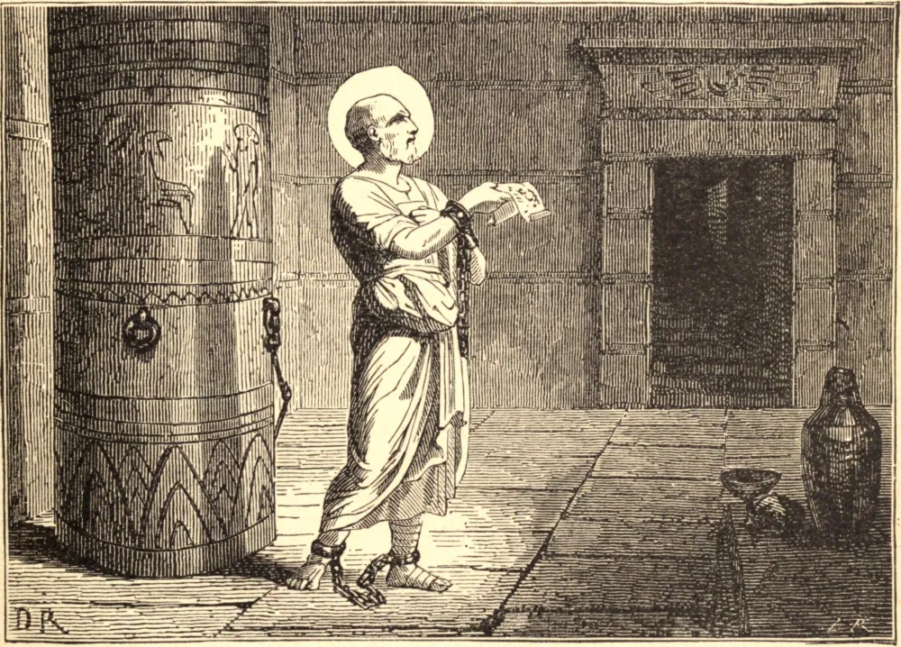

# 22 de abril — SÃO LEÔNIDES, Mártir

O imperador Severo, no ano de 202, que foi o décimo de seu reinado, suscitou uma sangrenta perseguição, que encheu de mártires todo o império, mas especialmente o Egito. O mais ilustre dentre aqueles que, por seus triunfos, enobreceram e edificaram a cidade de Alexandria foi Leônides, pai do grande Orígenes. Era um filósofo cristão, e excelentemente versado tanto nas ciências profanas quanto nas sagradas. Tinha sete filhos, o mais velho dos quais era Orígenes, a quem criou com abundância de cuidado, dando graças a Deus por o haver abençoado com um filho de tão excelente disposição para o aprendizado e de tão grande zelo pela piedade. Estas qualidades tornavam-no muito caro a seu pai, que, depois de o filho ser batizado, costumava chegar-se à sua cabeceira enquanto dormia, e, abrindo-lhe o peito, beijava-o respeitosamente, por ser ele o templo do Espírito Santo.

Quando a perseguição grassava em Alexandria, sob Leto, governador do Egito, no décimo ano de Severo, Leônides foi lançado na prisão. Orígenes, que tinha então apenas dezessete anos de idade, ardia de um incrível desejo de martírio, e buscava toda ocasião de encontrá-lo. Mas sua mãe o conjurou a não a abandonar, e, redobrando seu ardor à vista das cadeias do pai, viu-se ela forçada a trancar todas as suas roupas para obrigá-lo a ficar em casa. Assim, não podendo fazer mais nada, escreveu uma carta a seu pai em termos muito comoventes, exortando-o fortemente a olhar para a coroa que lhe era oferecida com coragem e alegria, acrescentando esta cláusula: "Tomai cuidado, senhor, de não mudardes de ideia por nossa causa."

Leônides foi, por conseguinte, decapitado pela fé em 202. Confiscados e tomados todos os seus bens e propriedades para uso do imperador, sua viúva ficou com sete filhos para sustentar na mais pobre condição imaginável; mas a Divina Providência foi ao mesmo tempo seu conforto e seu amparo.
