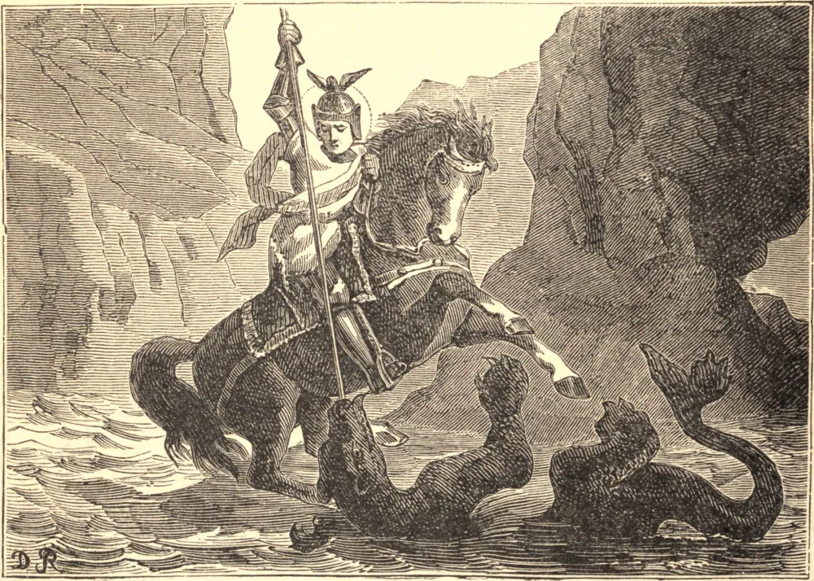

# 23 de abril — SÃO JORGE, Mártir

SÃO JORGE nasceu na Capadócia, no fim do terceiro século, de pais cristãos. Na primeira juventude escolheu a vida de soldado, e logo obteve o favor de Diocleciano, que o elevou ao grau de tribuno. Quando, porém, o imperador começou a perseguir os cristãos, Jorge repreendeu-o de pronto, severa e abertamente, por sua crueldade, e renunciou ao seu posto. Foi, em consequência, submetido a uma prolongada série de tormentos, e por fim decapitado.

Havia algo de tão inspirador na desafiadora jovialidade do jovem soldado, que todo cristão sentiu uma participação pessoal neste triunfo da fortaleza cristã; e, à medida que os anos rolaram, São Jorge tornou-se um tipo do combate vitorioso contra o mal, o matador do dragão, o tema predileto das canções e histórias dos acampamentos, até que "tão espessa sombra a sua própria glória ao redor dele fez" que seus verdadeiros traços se tornaram difíceis de discernir. Mesmo além do círculo da cristandade era tido em honra, e os sarracenos invasores ensinavam a si mesmos a excetuar da profanação a imagem daquele que saudavam como o "Cavaleiro do Cavalo Branco."

A devoção a São Jorge é uma das mais antigas e amplamente difundidas na Igreja. No Oriente, uma igreja de São Jorge é atribuída a Constantino, e seu nome é invocado nas mais antigas liturgias; ao passo que no Ocidente, Malta, Barcelona, Valência, Aragão, Gênova e Inglaterra o escolheram como seu padroeiro.

**Reflexão**—"Que direi da fortaleza, sem a qual nem a sabedoria nem a justiça têm valor algum? A fortaleza não é do corpo, mas é uma constância da alma; pela qual somos vencedores na retidão, suportamos com paciência todas as adversidades e na prosperidade não nos envaidecemos. Carece desta fortaleza aquele que é vencido pelo orgulho, pela ira, pela cobiça, pela embriaguez e coisas semelhantes. Tampouco têm fortaleza os que, na adversidade, recorrem a expedientes para escapar à custa de suas almas; pelo que diz o Senhor: 'Não temais aqueles que matam o corpo, mas não podem matar a alma.' Do mesmo modo, os que se envaidecem na prosperidade e se entregam a uma excessiva jovialidade não podem ser chamados fortes. Pois como podem ser chamados fortes os que não conseguem esconder e reprimir a emoção do coração? A fortaleza nunca é vencida, ou, se vencida, não é fortaleza."—*São Bruno*.
