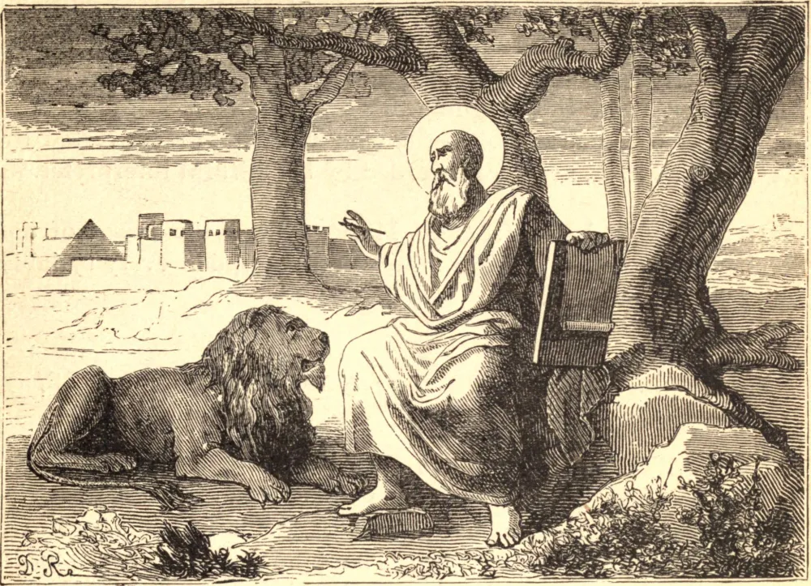

# 25 de abril — SÃO MARCOS, Evangelista

SÃO MARCOS foi convertido à Fé pelo Príncipe dos Apóstolos, a quem depois acompanhou a Roma, atuando ali como seu secretário ou intérprete. Quando São Pedro escrevia sua primeira epístola às igrejas da Ásia, junta afetuosamente à sua própria saudação a de seu fiel companheiro, a quem chama "meu filho Marcos." O povo romano suplicou a São Marcos que pusesse por escrito para eles a substância dos frequentes discursos de São Pedro sobre a vida de Nosso Senhor. Isto o Evangelista fez sob os olhos e com a expressa sanção do apóstolo, e cada página de seu breve mas vívido evangelho trazia de tal modo a marca do caráter de São Pedro, que os Padres costumavam chamá-lo "o Evangelho de Pedro." São Marcos foi então enviado ao Egito para fundar a Igreja de Alexandria. Aqui seus discípulos tornaram-se a maravilha do mundo por sua piedade e ascetismo, de modo que São Jerônimo fala de São Marcos como o pai dos anacoretas, que em tempo posterior afluíram aos desertos do Egito. Aqui, também, ele estabeleceu a primeira escola cristã, fecunda mãe de muitos ilustres doutores e bispos. Após governar sua sé por muitos anos, São Marcos foi um dia capturado pelos pagãos, arrastado por cordas sobre pedras e lançado na prisão. No dia seguinte a tortura foi repetida, e, tendo sido consolado por uma visão de anjos e pela voz de Jesus, São Marcos foi para sua recompensa.

É a São Marcos que devemos os muitos sutis toques que tantas vezes dão tão viva coloração às cenas do Evangelho, e nos ajudam a imaginar os próprios gestos e olhares de Nosso Senhor. É ele somente que nota que, na tentação, Jesus estava "com as feras;" que dormia no barco "sobre um travesseiro;" que "abraçou" as criancinhas. Só ele preserva para nós as palavras imperiosas "Paz, aquieta-te!" pelas quais a tempestade foi sossegada; ou mesmo os próprios sons de sua voz, o "Effatá" e o "Talitha cumi," pelos quais os mudos foram feitos falar e os mortos ressuscitar. Assim, também, o "olhar ao redor com ira" e o "suspirar profundamente," por muito tempo guardados na memória do apóstolo penitente, que foi ele próprio convertido pelo olhar de seu Salvador, são aqui registrados por seu fiel intérprete.

## Reflexão

Aprende de São Marcos a manter sempre diante de tua mente a imagem do Filho do homem, e a ponderar cada sílaba que caiu de seus lábios.
