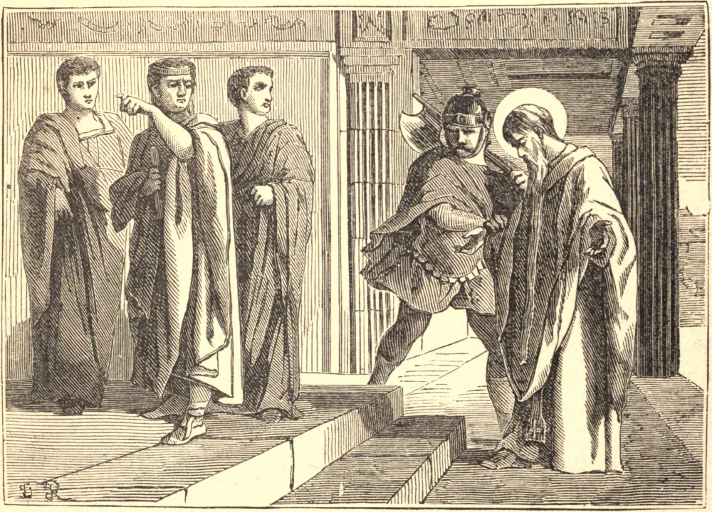

# 26 de abril — SÃO CLETO e SÃO MARCELINO, Papas, Mártires

SÃO CLETO foi o terceiro Bispo de Roma, e sucedeu a São Lino, circunstância que por si só mostra sua eminente virtude entre os primeiros discípulos de São Pedro no Ocidente. Ocupou a cátedra por doze anos, de 76 a 89. O cânon da Missa romana, Beda e outros martirologistas o intitulam mártir. Foi sepultado perto de São Lino, no Vaticano, e suas relíquias ainda permanecem naquela igreja.

São Marcelino sucedeu a São Caio no bispado de Roma em 296, por volta do tempo em que Diocleciano se erigiu em divindade e impiamente reclamava honras divinas. Naqueles tempestuosos tempos de perseguição, Marcelino adquiriu grande glória. Ocupou a cátedra de São Pedro oito anos, três meses e vinte e cinco dias, falecendo em 304, um ano depois de irromper a cruel perseguição, na qual ganhou muita honra. Foi intitulado mártir, ainda que seu sangue não tenha sido derramado na causa da religião.

## Reflexão

É máxima fundamental da moral cristã, e verdade que Cristo estabeleceu nos termos mais claros e em inúmeras passagens do Evangelho, que a cruz, ou os sofrimentos e a mortificação, são o caminho para a bem-aventurança eterna. Aqueles, portanto, que não levam aqui uma vida crucificada e mortificada são indignos de jamais possuir as inefáveis alegrias de seu reino. O próprio Nosso Senhor, nosso modelo e nossa cabeça, caminhou por esta senda, e seu grande Apóstolo nos lembra que ele entrou na bem-aventurança somente por seu sangue e por sua cruz.
