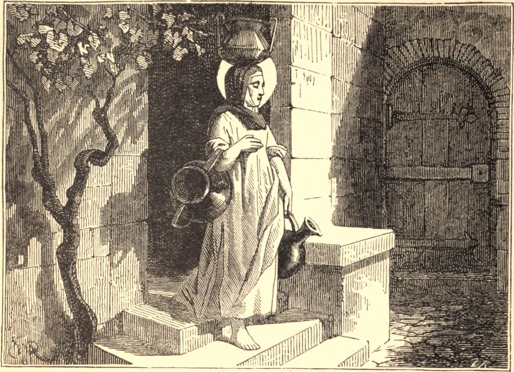

# 27 de abril — SANTA ZITA, Virgem

ZITA viveu durante quarenta e oito anos a serviço de Fatinelli, um cidadão de Lucca. Durante este tempo levantava-se cada manhã, enquanto a casa ainda dormia, para ouvir Missa, e depois labutava incessantemente até chegar a noite, fazendo o trabalho dos outros tão bem quanto o seu próprio. Certa vez Zita, absorta em oração, permaneceu na igreja além da hora habitual de fazer seu pão. Apressou-se a voltar para casa, censurando-se por negligência do dever, e encontrou o pão feito e pronto para o forno. Nunca duvidou de que sua senhora ou um dos seus criados o tivesse amassado, e, indo a eles, agradeceu-lhes; mas eles ficaram assombrados. Nenhum ser humano havia feito o pão. Dele subia um delicioso perfume, pois os anjos o haviam feito durante a sua oração. Por anos seu senhor e sua senhora a trataram como mera serviçal, enquanto seus companheiros de serviço, ressentindo-se de sua diligência como uma censura a si mesmos, insultavam-na e batiam-lhe. Zita unia estes sofrimentos aos de Cristo seu Senhor, jamais mudando o doce tom de sua voz, nem esquecendo seus modos brandos e quietos. Por fim Fatinelli, vendo o sucesso que acompanhava seus empreendimentos, deu-lhe o cuidado de seus filhos e da casa. Ela temia esta dignidade mais do que a pior humilhação, mas cumpriu escrupulosamente seu encargo. Por sua santa economia, os bens de seu senhor multiplicaram-se, enquanto os pobres eram alimentados à sua porta. Gradualmente sua infalível paciência venceu a inveja de seus companheiros de serviço, e ela se tornou advogada deles junto a seu senhor de temperamento exaltado, que não ousava ceder à sua ira diante de Zita. Ao fim, sua oração e seu trabalho santificaram a casa inteira, e atraíram sobre ela a bênção do Céu. Morreu em 1272, e no momento de sua morte uma brilhante estrela, aparecendo acima de seu sótão, mostrou que ela havia alcançado o repouso eterno.

## Reflexão

"Que devo fazer para me salvar?" disse certa pessoa, temendo a condenação. "Trabalha e ora, ora e trabalha", respondeu uma voz, "e serás salvo." Toda a vida de Santa Zita nos ensina esta verdade.
