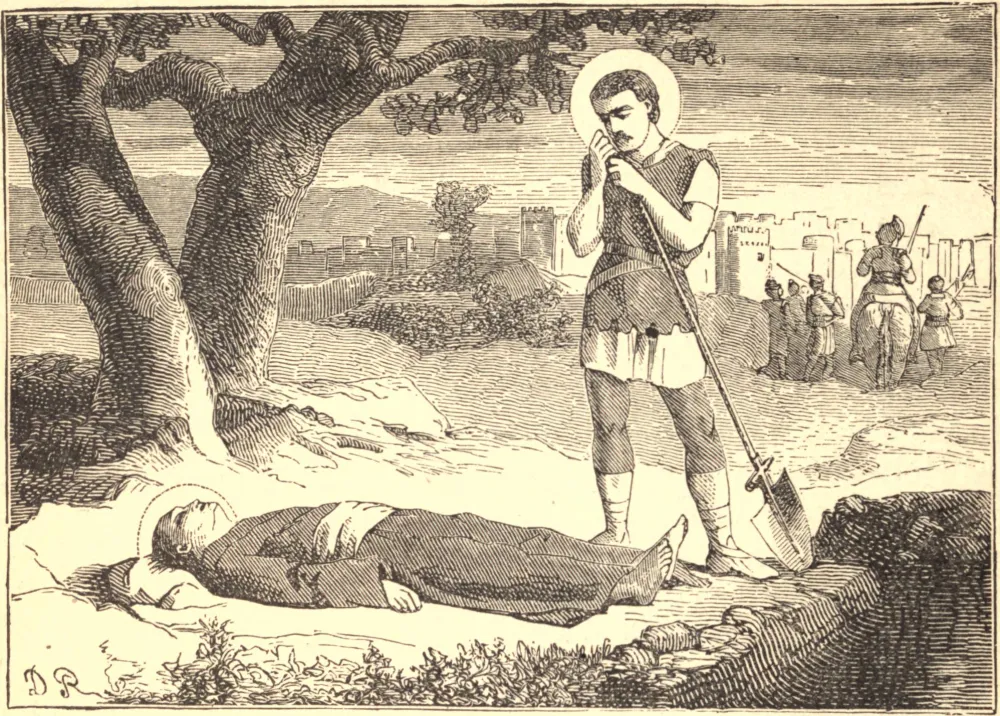

# SÃO VITAL, Mártir

SÃO VITAL era um cidadão de Milão, e diz-se que foi o pai de São Gervásio e São Protásio. A divina providência conduziu-o a Ravena, onde viu um cristão chamado Ursicino, que fora condenado a perder a cabeça pela sua fé, pasmado diante da visão da morte, e parecendo prestes a ceder. Vital comoveu-se extremamente com este espetáculo. Conhecia sua dupla obrigação de preferir a glória de Deus e a eterna salvação do próximo à sua própria vida corporal: por isso, com ousadia e êxito, encorajou Ursicino a triunfar sobre a morte, e após o martírio deste levou consigo o seu corpo, e o sepultou com respeito. O juiz, cujo nome era Paulino, sendo disto informado, mandou prender Vital, estendê-lo no potro, e, depois de outros tormentos, enterrá-lo vivo num lugar chamado a Palmeira, em Ravena. Sua esposa, Valéria, regressando de Ravena a Milão, foi espancada até a morte por camponeses, porque se recusou a unir-se a eles numa festa e tumulto idólatra.

## Reflexão

Nem todos somos chamados ao sacrifício do martírio; mas todos estamos obrigados a fazer de nossa vida um contínuo sacrifício de nós mesmos a Deus, e a realizar cada ação neste perfeito espírito de sacrifício. Assim viveremos e morreremos para Deus, perfeitamente resignados à Sua santa vontade em todas as Suas disposições.
