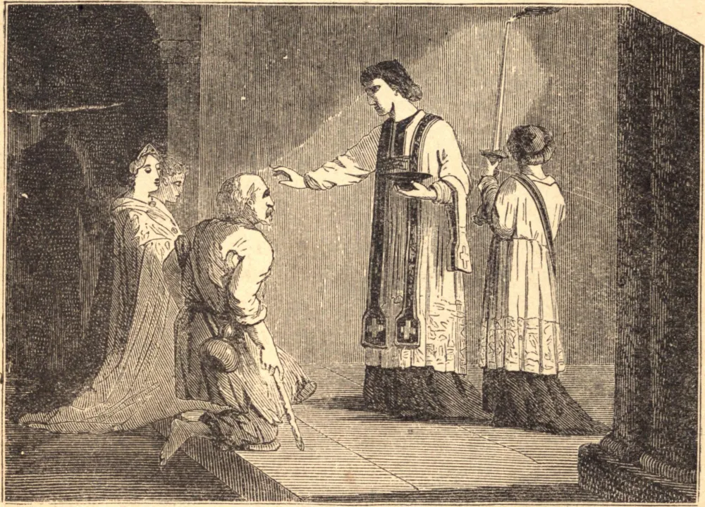

# Quarta-feira de Cinzas

O homem, tirado do pó, a ele deve retornar, e tudo o que entrementes faz, à exceção do bem que porventura realize, não passa de pó e vaidade; somente o bem subsiste. Tais são as verdades que a Igreja deseja gravar na memória, mas ainda mais nos corações de seus filhos, pela aspersão das cinzas neste primeiro dia da Quaresma.

Este costume data dos primeiros séculos da Igreja, e era então observado, não para com todos os fiéis sem distinção, mas para com os pecadores públicos que se haviam submetido à penitência canônica, a fim de obter por meio dela a reconciliação com a Igreja e a admissão à participação na Divina Eucaristia. O bispo impunha-lhes a obrigação de vestir o cilício e o traje penitente, colocando-lhes cinzas sobre a cabeça, e em seguida excluindo-os da igreja até o dia da Páscoa. Entrementes, tinham de permanecer humildemente prostrados ao pórtico da igreja, implorando as orações daqueles que, mais felizes do que eles, podiam assistir aos divinos mistérios no interior do edifício sagrado.

O costume de pôr cinzas sobre a cabeça em sinal de penitência é ainda mais antigo do que o cristianismo; os judeus o praticavam, e o santo Rei Davi nos diz que se havia submetido a tal observância. Pode-se antes dizer que data das primeiras idades do mundo; pois o santo homem Jó, muito antes mesmo do tempo de Moisés, seguia o costume.

Nada há, de fato, mais apto a levar o pecador a entrar em si mesmo do que a lembrança de seu último fim. Nada há mais próprio a abater o orgulho e a pôr freio aos projetos fúteis e aos propósitos culpados do que o terrível e triste memento: "Lembra-te de que não passas de pó." Impérios, riquezas, honras e dignidades, palácios resplandecentes, carros triunfais, belos adornos, beleza, vigor e poder, tudo se desmorona, e o próprio possuidor não é senão uma ruína, e, antes que poucos dias se escoem, terá esmaecido em pó.

**Reflexão**—Trazei, pois, sempre na memória, homens e pecadores, que "sois pó, e ao pó haveis de tornar."
