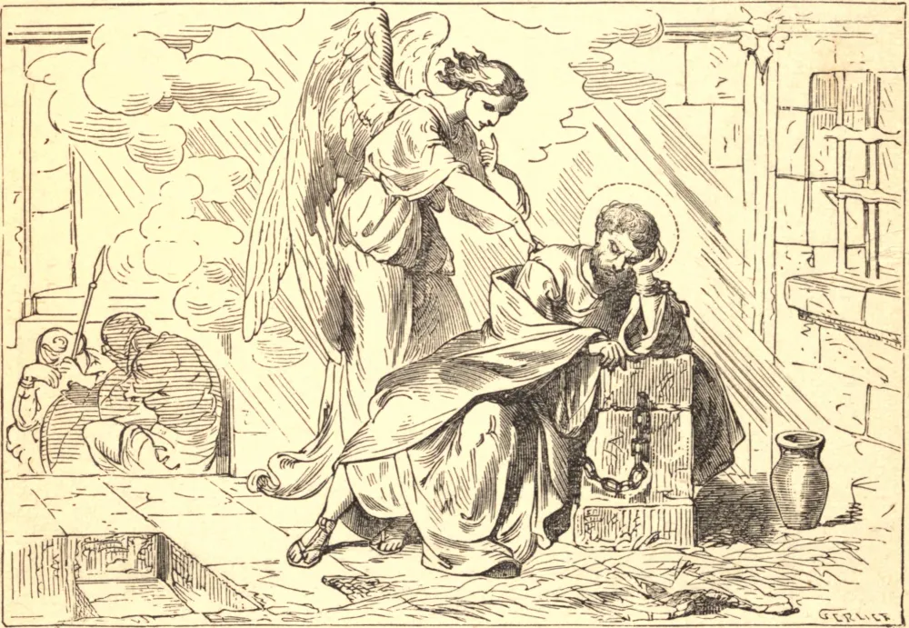

# 1 de agosto — AS CADEIAS DE SÃO PEDRO

HERODES AGRIPA, rei dos judeus, tendo mandado matar São Tiago Maior no ano de 44, a fim de granjear a afeição e o aplauso de seu povo, mandou lançar na prisão São Pedro, o príncipe do sagrado colégio. Sua intenção era pô-lo publicamente à morte depois da Páscoa. Toda a Igreja em Jerusalém elevava suas orações a Deus pela libertação do pastor supremo de todo o Seu rebanho, e Deus as ouviu favoravelmente. O rei tomou todas as precauções possíveis para impedir a fuga de seu prisioneiro. São Pedro dormia profundamente, na própria noite anterior ao dia destinado à sua execução, quando aprouve a Deus livrá-lo das mãos de seus inimigos. Era guardado por dezesseis soldados, quatro dos quais sempre montavam guarda por seus turnos: dois no mesmo calabouço com ele, e dois ao portão. Estava preso ao chão por duas correntes, e dormia entre os dois soldados. No meio da noite, uma luz brilhante resplandeceu na prisão, e um anjo apareceu junto a ele, e, tocando-lhe no lado, despertou-o do sono, e ordenou-lhe que se levantasse imediatamente, cingisse a túnica, calçasse as sandálias e o manto, e o seguisse. O apóstolo assim fez, pois as correntes haviam caído de suas mãos. Seguindo seu guia, passou após ele pelo primeiro e pelo segundo postos de guarda, e pelo portão de ferro que dava para a cidade, o qual se lhes abriu por si mesmo. O anjo conduziu-o por uma rua, e então, desaparecendo de súbito, deixou-o a buscar algum asilo. O apóstolo foi diretamente à casa de Maria, mãe de João, por sobrenome Marcos, onde vários discípulos se haviam reunido, e elevavam suas orações ao céu por sua libertação. Enquanto batia do lado de fora, uma jovem, reconhecendo a voz de Pedro, correu para dentro e informou a companhia de que ele estava à porta; concluíram que devia ser seu anjo da guarda, enviado por Deus por algum motivo extraordinário, até que, sendo introduzido, lhes relatou todo o modo de sua milagrosa fuga; e tendo-lhes ordenado que dessem notícia disto a São Tiago e aos demais irmãos, retirou-se para um lugar de maior retiro e segurança, levando, por onde quer que fosse, a celeste bênção e vida.

## Reflexão

Este milagre oferece uma confirmação da promessa divina: "Se dois de vós se puserem de acordo na terra sobre qualquer coisa que pedirem, ser-lhes-á concedida por Meu Pai que está nos céus."
