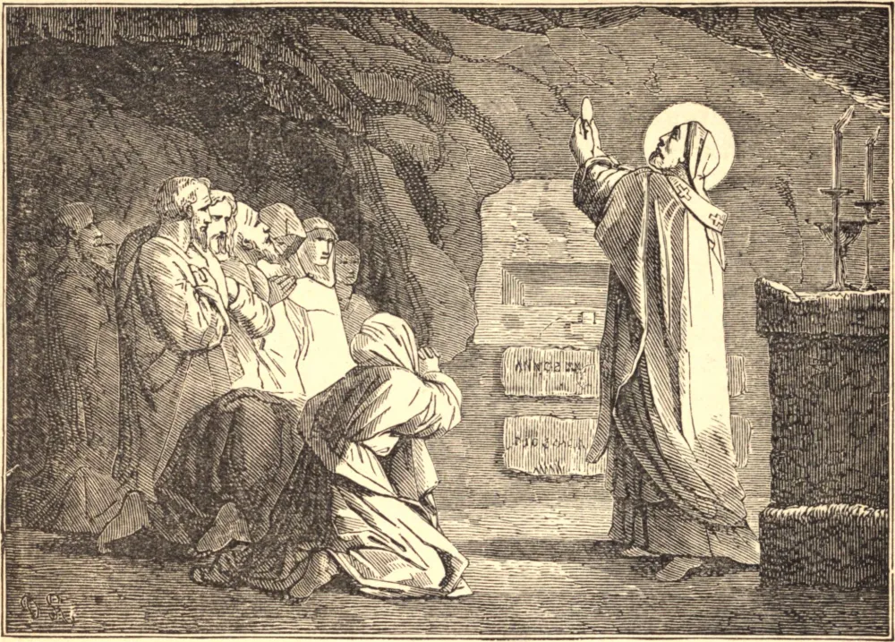

# 2 de agosto — SÃO ESTÊVÃO, Papa e Mártir

SÃO ESTÊVÃO era romano de nascimento, e, sendo promovido às ordens sacras, foi feito arcediago sob os santos Papas São Cornélio e São Lúcio. Tendo este último sofrido o martírio, São Estêvão foi escolhido para sucedê-lo, e foi eleito Papa no dia 3 de maio de 253. A controvérsia acerca do rebatismo dos hereges deu a São Estêvão muito trabalho. É ensinamento da Igreja Católica que o Batismo conferido em nome das três pessoas da Santíssima Trindade é válido, ainda que seja conferido por um herege. São Estêvão deixou-se pacientemente difamar como favorecedor da heresia por aprovar o batismo herético, não duvidando de que aqueles grandes homens que por zelo equivocado se haviam desviado, quando o calor da disputa houvesse abrandado, abririam serenamente os olhos para a verdade. Assim, por seu zelo preservou a integridade da fé, e por sua tolerância e paciência salvou muitas almas. Tornando-se violentas as perseguições, reuniu os fiéis nos túmulos subterrâneos dos mártires, para celebrar Missa e exortá-los a permanecerem fiéis a Cristo. No dia 2 de agosto de 257, enquanto estava sentado em sua cadeira pontifícia, foi decapitado pelos sequazes do imperador; e a cadeira ainda é mostrada, manchada de seu sangue.
