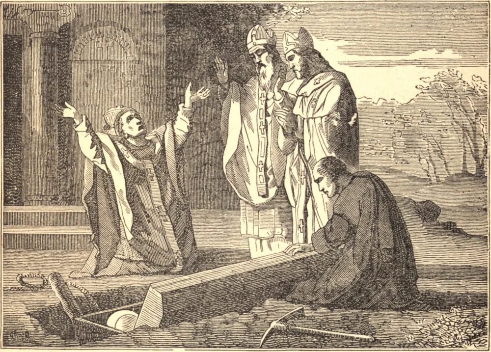

# 3 de agosto — O ACHADO DAS RELÍQUIAS DE SANTO ESTÊVÃO

A SEGUNDA festividade em honra do santo protomártir Santo Estêvão foi instituída pela Igreja por ocasião da descoberta de seus preciosos restos. Seu corpo jazera longo tempo oculto, sob as ruínas de um antigo túmulo, num lugar a vinte milhas de Jerusalém, chamado Cafargamala, onde havia uma igreja servida por um venerável sacerdote chamado Luciano. No ano de 415, na sexta-feira, dia 3 de dezembro, cerca das nove horas da noite, Luciano dormia em seu leito no batistério, onde costumava deitar-se a fim de guardar os vasos sagrados da igreja. Estando meio desperto, viu um ancião alto e formoso, de venerável aspecto, que se aproximou dele, e, chamando-o três vezes pelo nome, ordenou-lhe que fosse a Jerusalém e dissesse ao Bispo João que viesse abrir os túmulos em que jaziam seus restos e os de certos outros servos de Cristo, para que por meio deles Deus pudesse abrir a muitos as portas de Sua clemência. Esta visão repetiu-se duas vezes. Após a segunda vez, Luciano foi a Jerusalém e expôs todo o caso ao Bispo João, que lhe ordenou que fosse buscar as relíquias, as quais, concluiu o Bispo, se achariam sob um monte de pequenas pedras que jazia num campo perto de sua igreja. Cavando aqui a terra, três caixões ou arcas foram encontrados. Luciano mandou imediatamente avisar disto o Bispo João. Este estava então no Concílio de Diospólis, e, levando consigo Eutônio, Bispo de Sebaste, e Eleutério, Bispo de Jericó, veio ao lugar. Ao abrir-se o caixão de Santo Estêvão, a terra tremeu, e saiu do caixão um odor tão agradável que ninguém se lembrava de jamais ter cheirado coisa semelhante. Havia uma vasta multidão de pessoas reunida naquele lugar, entre as quais muitos afligidos por diversas enfermidades, dos quais setenta e três recobraram a saúde ali mesmo. Beijaram as santas relíquias, e depois as fecharam. O Bispo consentiu em deixar uma pequena porção delas em Cafargamala; o restante foi levado no caixão, com cânticos de salmos e hinos, à Igreja de Sião em Jerusalém. A trasladação realizou-se no dia 26 de dezembro, dia em que a Igreja desde então tem honrado a memória de Santo Estêvão, comemorando a descoberta de suas relíquias em 3 de agosto provavelmente por causa da dedicação de alguma igreja em sua honra.

## Reflexão

Santo Agostinho, falando dos milagres de Santo Estêvão, dirige-se ao seu rebanho assim: "Desejemos de tal modo obter, por sua intercessão, as bênçãos temporais, que mereçamos, ao imitá-lo, aquelas que são eternas."
