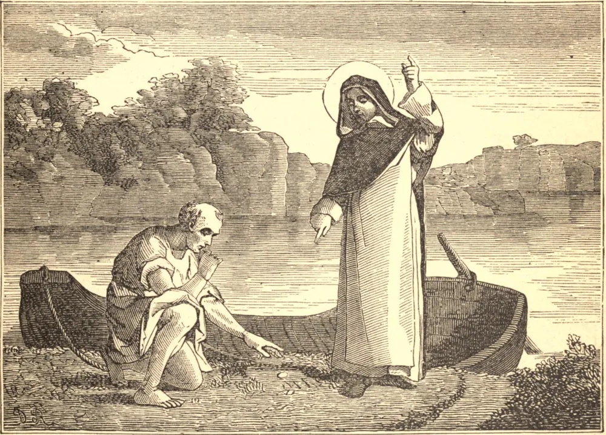

# 4 de agosto — SÃO DOMINGOS

SÃO DOMINGOS nasceu na Espanha, em 1170. Quando estudante, vendeu seus livros para alimentar os pobres durante uma fome, e ofereceu-se em resgate por um escravo. Aos vinte e cinco anos tornou-se superior dos Cônegos Regulares de Osma, e acompanhou seu Bispo à França. Ali seu coração quase se partiu diante dos estragos da heresia albigense, e sua vida foi dali em diante consagrada à conversão dos hereges e à defesa da Fé.

Para esse fim estabeleceu sua tríplice Ordem religiosa. O convento de freiras foi fundado primeiro, para resgatar moças da heresia e do crime. Depois uma companhia de homens apostólicos reuniu-se em torno dele, e tornou-se a Ordem dos Frades Pregadores. Por último vieram os Terciários, pessoas de ambos os sexos vivendo no mundo. Deus abençoou a nova Ordem, e a França, a Itália, a Espanha e a Inglaterra acolheram os Frades Pregadores.

Nossa Senhora tomou-os sob sua proteção especial, e sussurrava a São Domingos enquanto ele pregava. Foi em 1208, enquanto São Domingos estava ajoelhado na pequena capela de Notre Dame de la Prouille, e implorava à grande Mãe de Deus que salvasse a Igreja, que Nossa Senhora apareceu-lhe, deu-lhe o Rosário, e ordenou-lhe que saísse e pregasse. Com as contas na mão, ele reanimou a coragem das tropas católicas, conduziu-as à vitória contra números esmagadores, e por fim esmagou a heresia.

Suas noites eram passadas em oração; e, embora puro como uma virgem, três vezes antes de raiar a manhã flagelava-se até sangrar. Suas palavras resgataram inumeráveis almas, e três vezes ressuscitaram os mortos. Por fim, a 6 de agosto de 1221, aos cinquenta e um anos, entregou sua alma a Deus.

**Reflexão**—"Deus nunca", dizia São Domingos, "me recusou o que pedi;" e ele nos deixou o Rosário, para que aprendamos, com o auxílio de Maria, a orar fácil e simplesmente na mesma santa confiança.
