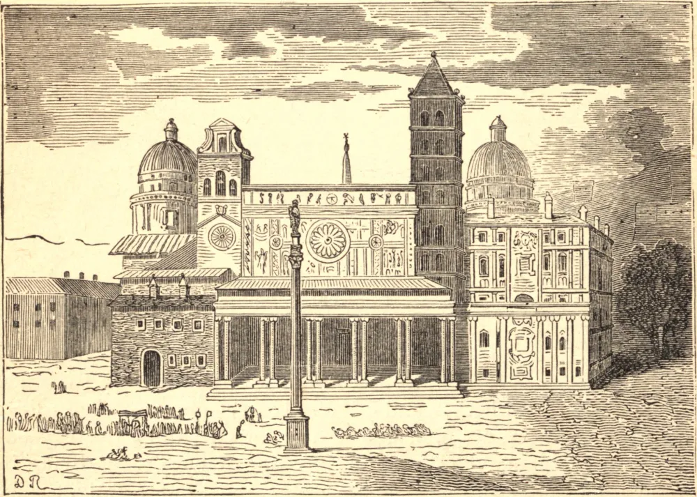

# 5 de agosto — A DEDICAÇÃO DE SANTA MARIA AD NIVES

HÁ em Roma três igrejas patriarcais, nas quais o Papa oficia em diferentes festividades. São elas as Basílicas de São João de Latrão, de São Pedro no Monte Vaticano, e de Santa Maria Maior. Esta última é assim chamada porque é, tanto em antiguidade como em dignidade, a primeira igreja de Roma entre aquelas que são dedicadas a Deus em honra da Virgem Maria. O nome de Basílica Liberiana foi-lhe dado porque foi fundada no tempo do Papa Libério, no quarto século; foi consagrada, sob o título da Virgem Maria, por Sisto III, por volta do ano 435. É também chamada Santa Maria ad Nives, ou *junto à neve*, de uma tradição popular segundo a qual a Mãe de Deus escolheu este lugar para uma igreja sob sua invocação por uma neve milagrosa que caiu sobre este local no verão, e por uma visão na qual ela apareceu a um patrício chamado João, que magnificamente fundou e dotou esta igreja no pontificado de Libério. A mesma Basílica foi às vezes conhecida pelo nome de Santa Maria *ad Præsepe*, do santo berço ou manjedoura de Belém, na qual Cristo foi reclinado em Seu nascimento. Ela se assemelha a uma manjedoura comum, é conservada num estojo de prata maciça, e nela jaz uma imagem de um menininho, também de prata. No Dia de Natal a santa Manjedoura é retirada do estojo, e exposta. É conservada numa suntuosa capela subterrânea nesta igreja.

## Reflexão

Para tornar nossas súplicas mais eficazes, devemos uni-las em espírito às de todos os fervorosos penitentes e almas devotas, ao invocar esta advogada dos pecadores.
