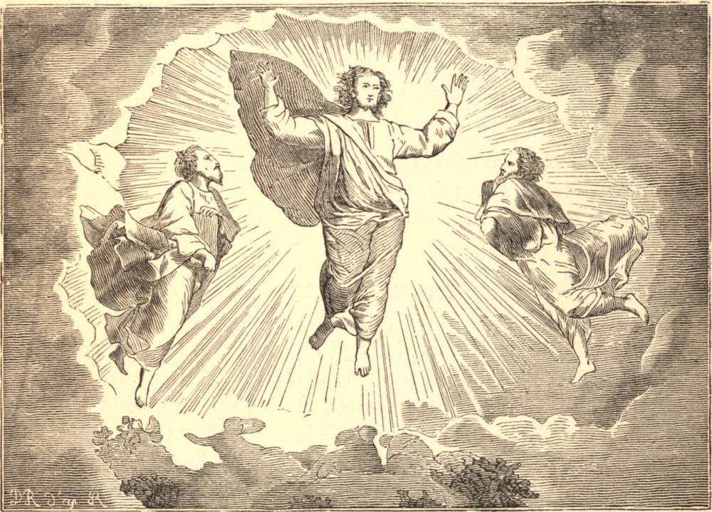

# 6 de agosto — A TRANSFIGURAÇÃO DE NOSSO SENHOR

NOSSO divino Redentor, estando na Galileia cerca de um ano antes de Sua sagrada Paixão, tomou consigo São Pedro e os dois filhos de Zebedeu, São Tiago e São João, e conduziu-os a um monte retirado. A tradição assegura-nos que este era o Monte Tabor, que é sobremaneira alto e belo, e que era antigamente coberto de árvores verdes e arbustos, e era muito fértil. Ele se ergue algo como um pão de açúcar, numa vasta planície no meio da Galileia.

Este foi o lugar em que o Homem-Deus apareceu em Sua glória. Enquanto Jesus orava, Ele permitiu àquela glória que era sempre devida à Sua sagrada humanidade, e da qual, por amor de nós, Ele a privara, difundir um raio sobre todo o Seu corpo. Seu rosto transfigurou-se e resplandeceu como o sol, e Suas vestes tornaram-se brancas como a neve.

Moisés e Elias foram vistos pelos três apóstolos em Sua companhia nesta ocasião, e foram ouvidos conversando com Ele acerca da morte que Ele haveria de sofrer em Jerusalém. Os três apóstolos ficaram maravilhosamente deleitados com esta gloriosa visão, e São Pedro exclamou a Cristo: "Senhor, é bom para nós estarmos aqui. Façamos três tendas: uma para Ti, uma para Moisés, e uma para Elias."

Enquanto São Pedro falava, veio, de repente, uma nuvem brilhante e resplandecente do céu, emblema da presença da majestade de Deus, e de dentro desta nuvem ouviu-se uma voz que dizia: "Este é Meu Filho amado, em Quem pus toda a Minha complacência; a Ele ouvi." Os apóstolos que estavam presentes, ao ouvirem esta voz, foram tomados de um súbito temor, e caíram por terra; mas Jesus, indo a eles, tocou-os, e ordenou-lhes que se levantassem.

Eles imediatamente o fizeram, e não viram a ninguém senão Jesus em pé em seu estado ordinário. Esta visão aconteceu de noite. Ao descerem o monte na manhã seguinte, cedo, Jesus ordenou-lhes que não dissessem a ninguém o que tinham visto até que Ele houvesse ressuscitado dos mortos.

**Reflexão**—Da contemplação deste glorioso mistério devemos conceber uma verdadeira ideia da felicidade futura; se esta uma vez possuir nossas almas, nada pensaremos de quaisquer dificuldades ou trabalhos que aqui possamos encontrar, mas consideraremos com grande indiferença todos os bens e males desta vida, contanto que possamos assegurar a nossa porção no reino da glória de Deus.
