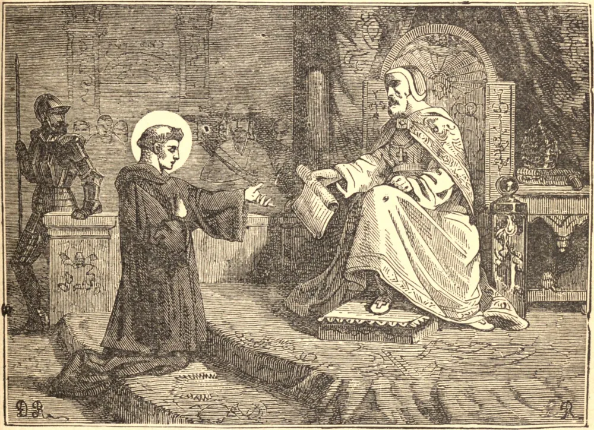

# 7 de agosto — SÃO CAETANO

CAETANO nasceu em Vicenza, em 1480, de pais piedosos e nobres, que o consagraram a Nossa Senhora. Desde a infância era conhecido como o Santo, e em anos posteriores como "o caçador de almas." Estudante distinto, deixou sua cidade natal para buscar a obscuridade em Roma, mas ali foi forçado a aceitar um cargo na corte de Júlio II. À morte daquele Pontífice retornou a Vicenza, e desgostou seus parentes ao ingressar na Confraria de São Jerônimo, cujos membros provinham das classes mais baixas; enquanto gastava sua fortuna construindo hospitais, e dedicava-se a cuidar dos atingidos pela peste. Para renovar a vida do clero, instituiu a primeira comunidade de Clérigos Regulares, conhecidos como Teatinos. Eles dedicavam-se à pregação, à administração dos sacramentos, e ao cuidadoso desempenho dos ritos e cerimônias da Igreja. São Caetano foi o primeiro a introduzir a Adoração das Quarenta Horas do Santíssimo Sacramento, como antídoto à heresia de Calvino. Ele tinha um amor terníssimo por Nossa Senhora, e sua piedade foi recompensada, pois numa véspera de Natal ela colocou o Menino Jesus em seus braços. Quando os alemães, sob o Condestável de Bourbon, saquearam Roma, São Caetano foi barbaramente flagelado, para extorquir-lhe riquezas que ele muito antes havia seguramente entesourado no céu. Quando São Caetano estava em seu leito de morte, resignado à vontade de Deus, ávido pela dor para satisfazer seu amor, e pela morte para alcançar a vida, contemplou a Mãe de Deus, radiante de esplendor e cercada de serafins ministrantes. Em profunda veneração, disse: "Senhora, abençoai-me!" Maria respondeu: "Caetano, recebe a bênção de meu Filho, e sabe que estou aqui como recompensa pela sinceridade de teu amor, e para conduzir-te ao paraíso." Ela então exortou-o à paciência ao combater um espírito maligno que o atormentava, e deu ordens aos coros dos anjos para escoltarem sua alma em triunfo ao céu. Então, voltando para ele seu semblante cheio de majestade e doçura, disse: "Caetano, meu Filho te chama. Vamos em paz." Esgotado pela labuta e pela enfermidade, foi para sua recompensa em 1547.

## Reflexão

Imita a devoção de São Caetano a Nossa Senhora, invocando seu auxílio antes de cada obra.
