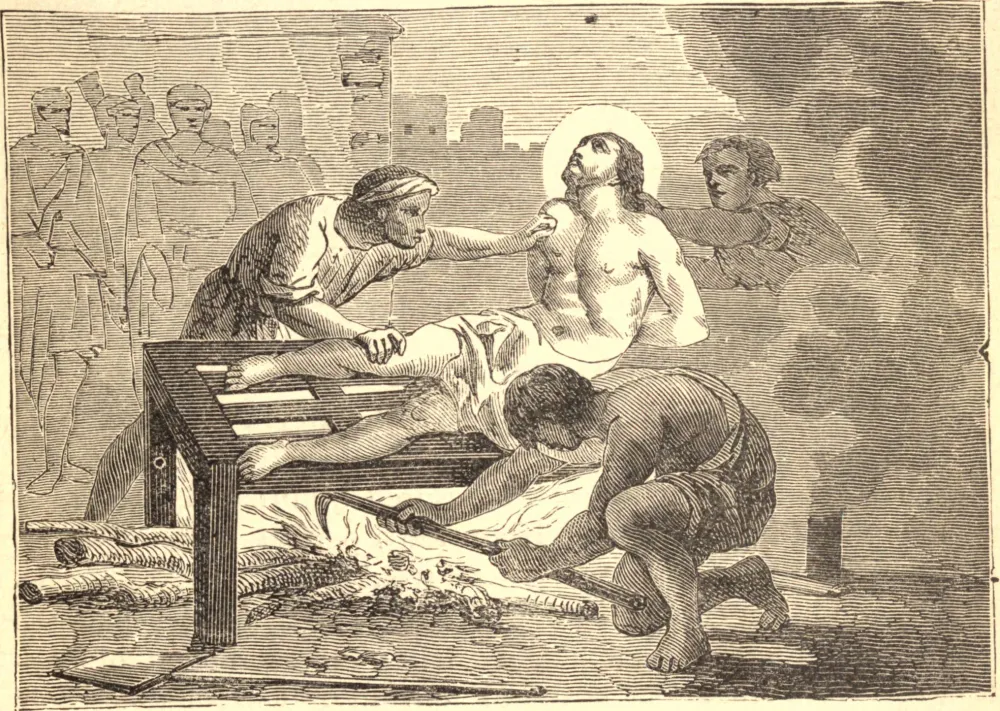

# 10 de agosto — SÃO LOURENÇO, Mártir

SÃO LOURENÇO era o principal entre os sete diáconos da Igreja Romana. No ano de 258 o Papa Sisto foi conduzido para fora a fim de morrer, e São Lourenço ficou ao seu lado, chorando por não poder partilhar de sua sorte. "Eu era teu ministro", disse ele, "quando consagravas o sangue de Nosso Senhor; por que me deixas para trás agora que estás prestes a derramar o teu próprio?" O santo Papa consolou-o com as palavras: "Não chores, meu filho; dentro de três dias me seguirás." Esta profecia cumpriu-se. O prefeito da cidade conhecia as ricas ofertas que os cristãos punham nas mãos do clero, e exigiu de Lourenço, seu guardião, os tesouros da Igreja Romana. O Santo prometeu, ao fim de três dias, mostrar-lhe riquezas que excediam toda a opulência do império, e pôs-se a reunir os pobres, os enfermos, e os religiosos que viviam das esmolas dos fiéis. Então ordenou ao prefeito que "visse os tesouros da Igreja." Cristo, a quem Lourenço havia servido em seus pobres, deu-lhe força no conflito que se seguiu. Assado sobre um fogo lento, zombava de suas dores. "Já estou assado o bastante", disse, "come, se quiseres." Por fim Cristo, o Pai dos pobres, recebeu-o nas habitações eternas. Deus mostrou, pela glória que resplandeceu em torno de São Lourenço, o valor que atribuía ao seu amor pelos pobres. Orações inumeráveis foram concedidas em seu túmulo; e ele continuou, de seu trono no céu, sua caridade para com os necessitados, concedendo-lhes, como diz Santo Agostinho, "as graças menores que buscavam, e conduzindo-os ao desejo de dons melhores."

## Reflexão

Nosso Senhor aparece diante de nós nas pessoas dos pobres. A caridade para com eles é um grande sinal de predestinação. É quase impossível, asseguram-nos os santos Padres, que qualquer um que seja caritativo para com os pobres por amor de Cristo venha a perecer.
