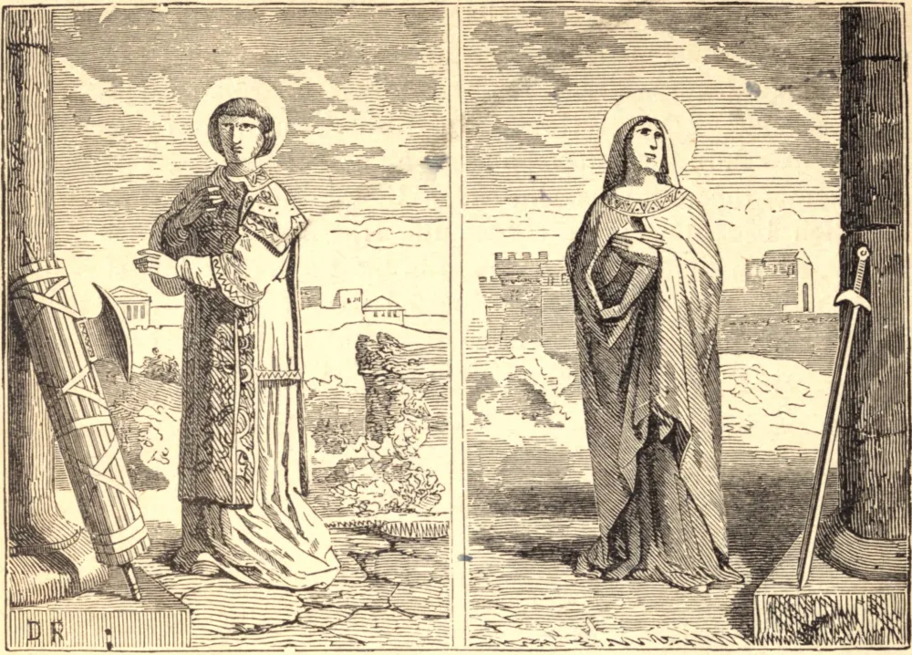

# 11 de agosto — SÃO TIBÚRCIO e SANTA SUSANA, Mártires

AGRÉSTIO CROMÁCIO era vigário do prefeito de Roma, e havia condenado vários mártires no reinado de Carino; e nos primeiros anos de Diocleciano, São Tranquilino, sendo levado diante dele, assegurou-lhe que, tendo sido afligido pela gota, recuperara um perfeito estado de saúde ao ser batizado. Cromácio estava atormentado pela mesma enfermidade, e convencido por este milagre da verdade do Evangelho, mandou chamar um sacerdote, e, recebendo o Sacramento do Batismo, viu-se livre daquela enfermidade corporal. O filho de Cromácio, Tibúrcio, foi ordenado subdiácono, e foi pouco depois entregue aos perseguidores, condenado a muitos tormentos, e por fim decapitado na Estrada Lavicana, a três milhas de Roma, onde depois se edificou uma igreja. Seu pai, Cromácio, retirando-se para o campo, ali viveu escondido, na fervorosa prática de todas as virtudes cristãs.

SANTA SUSANA nasceu nobremente em Roma, e diz-se ter sido sobrinha do Papa Caio. Tendo feito um voto de virgindade, recusou-se a casar, motivo pelo qual foi denunciada como cristã, e sofreu com heroica constância um cruel martírio. Santa Susana sofreu por volta do início do reinado de Diocleciano, cerca do ano 295.

**Reflexão**—Os sofrimentos foram para os mártires a mais distinta misericórdia, graças extraordinárias, e fontes das maiores coroas e glória. Todas as aflições que Deus envia são, de igual modo, as maiores misericórdias e bênçãos; são os mais preciosos talentos a serem aproveitados por nós para o crescimento de nosso amor e afeição a Deus, e o exercício das mais heroicas virtudes da abnegação, paciência, humildade, resignação, e penitência.
