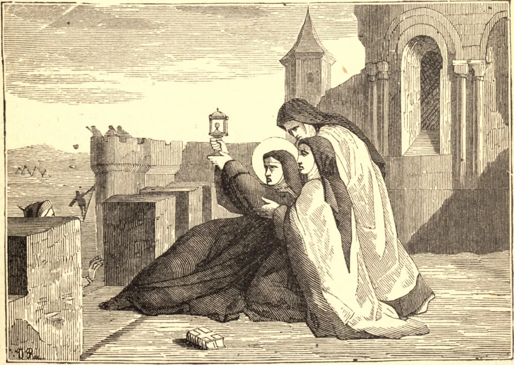

# 12 de agosto — SANTA CLARA, Abadessa

NO Domingo de Ramos, 17 de março de 1212, o Bispo de Assis deixou o altar para apresentar uma palma a uma nobre donzela, de dezoito anos de idade, que a timidez havia retido em seu lugar. Esta donzela era Santa Clara. Já havia aprendido de São Francisco a odiar o mundo, e estava secretamente resolvida a viver para Deus somente. Naquela mesma noite ela escapou, com uma companheira, para a Igreja da Porciúncula, onde foi recebida por São Francisco e seus irmãos. Ao altar de Nossa Senhora, São Francisco cortou-lhe os cabelos, revestiu-a de seu hábito de penitência, um pedaço de cilício, com sua corda por cíngulo. Assim foi desposada com Cristo. Numa miserável casa fora de Assis fundou sua Ordem, e a ela se juntou sua irmã, de quatorze anos de idade, e depois sua mãe e outras nobres senhoras. Andavam descalças, observavam abstinência perpétua, silêncio constante, e perfeita pobreza. Enquanto o exército sarraceno de Frederico II devastava o vale de Espoleto, um corpo de infiéis avançou para assaltar o convento de Santa Clara, que se situava fora de Assis. A Santa mandou colocar o Santíssimo Sacramento numa custódia, acima do portão do mosteiro voltado para o inimigo, e ajoelhando-se diante dele, orou: "Não entregues às feras, ó Senhor, as almas daqueles que Te confessam." Uma voz da Hóstia respondeu: "Minha proteção nunca te faltará." Um súbito pânico apoderou-se da hoste infiel, que se pôs em fuga, e o convento da Santa foi poupado. Durante sua enfermidade de vinte e oito anos, a Santa Eucaristia foi seu único sustento, e fiar linho para o altar a única obra de suas mãos. Morreu em 1253, enquanto se lia a Paixão, e Nossa Senhora e os anjos conduziram-na à glória.

## Reflexão

Numa época luxuriosa e efeminada, as filhas de Santa Clara ainda ostentam o nobre título de pobres, e pregam por sua vida cotidiana a pobreza de Jesus Cristo.
