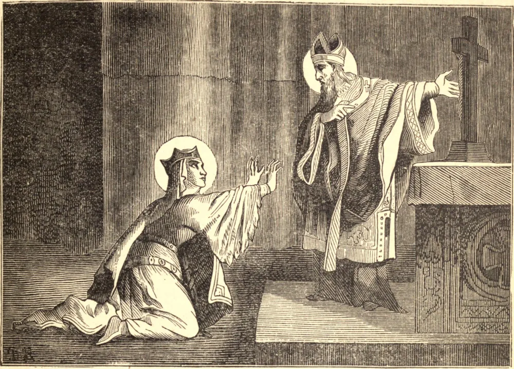

# 13 de agosto — SANTA RADEGUNDES, Rainha

SANTA RADEGUNDES era filha de um rei da Turíngia que foi assassinado por seu irmão; sobrevindo uma guerra, nossa Santa, à idade de doze anos, foi feita prisioneira e levada cativa por Clotário, Rei de Soissons, que a mandou instruir na religião cristã e batizar. Os grandes mistérios de nossa Fé causaram tal impressão em sua alma terna que ela se deu a Deus de todo o coração, e desejou consagrar-Lhe sua virgindade; foi, porém, por fim obrigada a ceder ao desejo do rei de que se tornasse sua esposa. Como grande rainha, continuou não menos inimiga da indolência e da vaidade do que era antes, e dividia seu tempo principalmente entre seu oratório, a Igreja, e o cuidado dos pobres. Guardava também longos jejuns, e durante a Quaresma vestia um cilício sob suas ricas vestes. Clotário a princípio agradava-se de suas devoções, e permitia-lhe plena liberdade nelas, mas depois costumava com frequência censurá-la por seus exercícios piedosos, dizendo que havia desposado uma freira e não uma rainha, que convertia sua corte num mosteiro. Vendo que Clotário estava inflamado por más paixões, nossa Santa pediu e obteve sua licença para retirar-se da corte. Foi para Noyon, e foi consagrada diaconisa por São Medardo. Radegundes primeiro retirou-se para Sais, e algum tempo depois foi para Poitiers, e ali edificou um grande mosteiro. Fez com que uma santa virgem, chamada Inês, fosse a primeira abadessa, e prestava-lhe implícita obediência em todas as coisas, não reservando para si a disposição da menor coisa. O Rei Clotário, arrependido de sua má conduta, desejava que ela retornasse à corte, mas, por intercessão de São Germano de Paris, foi-lhe permitido permanecer em seu retiro, onde morreu no dia 13 de agosto de 587.
