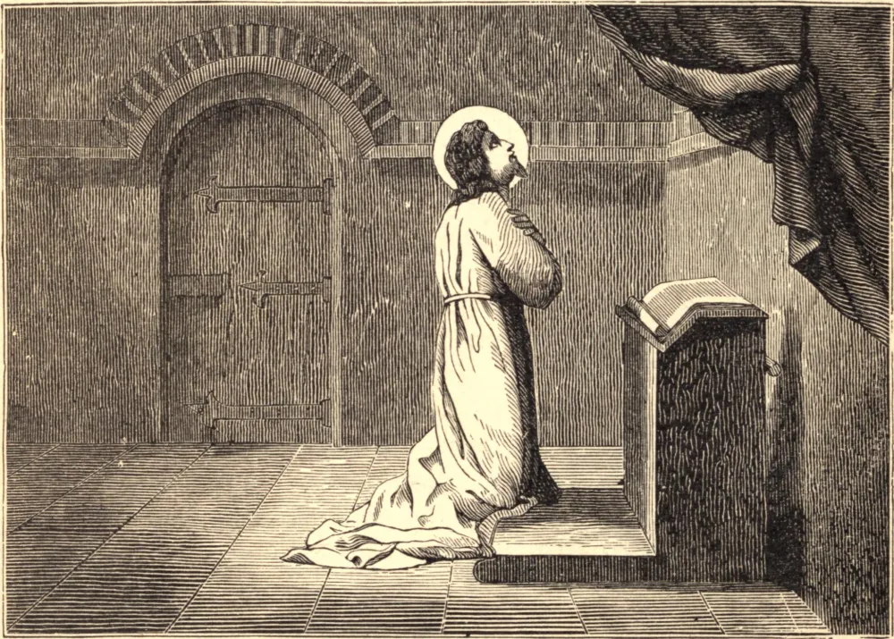

# 14 de agosto — SANTO EUSÉBIO, Sacerdote

A Igreja celebra neste dia a memória de Santo Eusébio, que se opôs aos arianos, em Roma, com tanto zelo. Foi encarcerado em seu quarto por ordem do Imperador Constâncio, e santificou seu cativeiro com oração constante. Outro Santo do mesmo nome, sacerdote e mártir, é comemorado neste dia. No reinado de Diocleciano e Maximiano, antes que houvessem publicado quaisquer novos éditos contra os cristãos, Eusébio, um santo sacerdote, homem eminentemente dotado do espírito de oração e de todas as virtudes apostólicas, sofreu a morte pela Fé, provavelmente na Palestina. Achando-se o Imperador Maximiano naquele país, fez-se uma queixa a Maxêncio, presidente da província, de que Eusébio se distinguia por seu zelo em invocar e pregar a Cristo, e o santo homem foi preso. Maximiano era bárbaro de nascimento, e um dos mais rudes e brutais e selvagens de todos os homens. Contudo, a virtude impávida e modesta deste estrangeiro, realçada por uma graça celestial, encheu-o de temor reverente. Desejava salvar o servo de Cristo, mas, como Pilatos, não queria dar-se trabalho algum nem arriscar incorrer no desagrado daqueles a quem em todas as outras ocasiões desprezava. Maxêncio ordenou a Eusébio que sacrificasse aos deuses, e recusando-se o Santo, o presidente condenou-o a ser decapitado. Eusébio, ao ouvir a sentença pronunciada, disse em voz alta: "Agradeço a Vossa bondade e louvo o Vosso poder, ó Senhor Jesus Cristo, que, chamando-me à prova de minha fidelidade, tratastes-me como um dos Vossos." Naquele instante ouviu uma voz do céu dizer-lhe: "Se não tivesses sido achado digno de sofrer, não poderias ser admitido à corte de Cristo nem aos assentos dos justos." Chegando ao lugar da execução, ajoelhou-se, e sua cabeça foi decepada.

## Reflexão

Aprendamos, do exemplo dos Santos, a coragem no serviço de Deus. Ele nos chama a suportar o sofrimento de corpo e de mente, se for necessário, para provar nossa fidelidade a Ele; e promete sustentar-nos por Sua força, Sua luz, e Sua celestial consolação.
