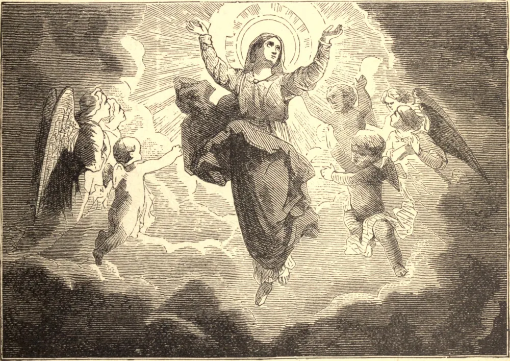

# 15 de agosto — A ASSUNÇÃO DA SANTÍSSIMA VIRGEM MARIA

NESTA festividade a Igreja comemora a feliz partida desta vida da Santíssima Virgem Maria, e sua translação ao reino de seu Filho, no qual ela recebeu d'Ele uma coroa de glória imortal, e um trono acima de todos os demais Santos e espíritos celestiais. Depois que Cristo, como triunfante Vencedor da morte e do inferno, ascendeu ao céu, sua Mãe bendita permaneceu em Jerusalém, perseverando em oração com os discípulos, até que, com eles, recebeu o Espírito Santo. Ela viveu até idade muito avançada, mas afinal pagou a dívida comum da natureza, não sendo nenhum dentre os filhos de Adão isento dessa rigorosa lei. Mas a morte dos Santos deve antes ser chamada um doce sono do que morte; muito mais a da Rainha dos Santos, que fora isenta de todo pecado. É uma crença piedosa tradicional que o corpo da Santíssima Virgem foi ressuscitado por Deus logo após sua morte, e elevado à glória, por singular privilégio, antes da ressurreição geral dos mortos. A Assunção da Santíssima Virgem Maria é a maior de todas as festividades que a Igreja celebra em sua honra. É a consumação de todos os demais grandes mistérios pelos quais sua vida foi tornada admirabilíssima; é o dia natalício de sua verdadeira grandeza e glória, e a coroação de todas as virtudes de toda a sua vida, que admiramos isoladamente em suas outras festividades.

## Reflexão

Enquanto contemplamos, em profundos sentimentos de veneração, assombro e louvor, a glória à qual Maria é elevada por seu triunfo neste dia, devemos, para nosso próprio proveito, considerar por que meios ela chegou a este sublime grau de honra e felicidade, a fim de que caminhemos sobre seus passos. Nenhum outro caminho nos está aberto. A mesma senda que a conduziu à glória também nos levará até lá; seremos partícipes de sua recompensa se copiarmos suas virtudes.
