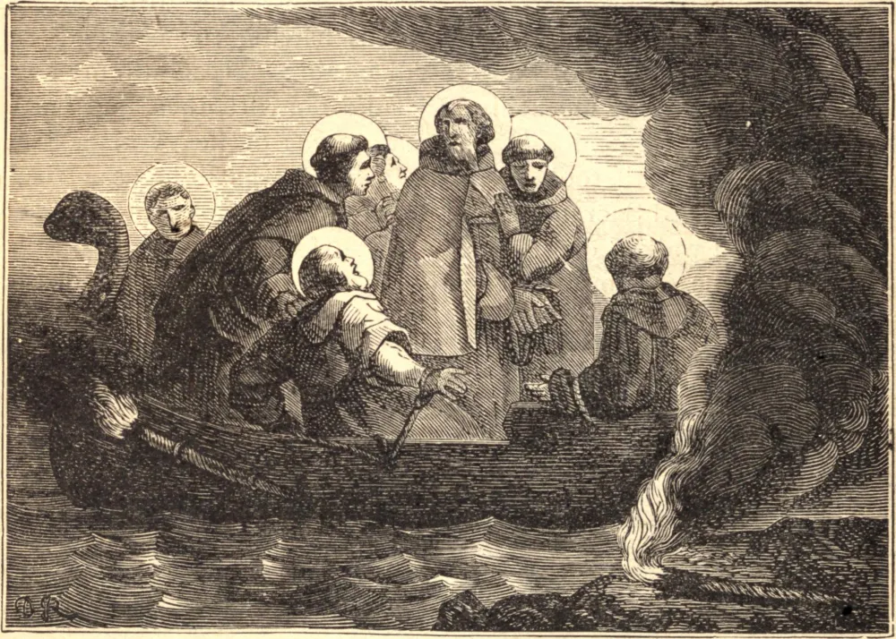

# 17 de agosto — SÃO LIBERATO, Abade, e Seis Monges, Mártires

HUNERICO, o rei vândalo ariano na África, no sétimo ano de seu reinado, publicou novos éditos contra os católicos, e ordenou que seus mosteiros fossem por toda parte demolidos. Sete monges, chamados Liberato, Bonifácio, Servo, Rústico, Rogato, Séptimo e Máximo, que viviam num mosteiro próximo a Cápsa, na província de Bizacena, foram naquele tempo convocados a Cartago. Foram primeiramente tentados com grandes promessas, mas, como permaneceram constantes na crença na Trindade, e num só Batismo, foram carregados de ferros e lançados num calabouço tenebroso.

Os fiéis, tendo subornado os guardas, visitavam os Santos dia e noite, para serem por eles instruídos e mutuamente animarem-se uns aos outros a sofrer pela fé de Cristo. O rei, sabendo disso, mandou que fossem mais estreitamente confinados, carregados de ferros mais pesados, e torturados com uma crueldade jamais ouvida até aquele tempo. Pouco depois, condenou-os a serem postos num velho navio e queimados no mar.

Os mártires caminharam alegremente para a praia, desprezando os insultos dos arianos à medida que passavam. Particulares esforços foram empregados pelos perseguidores para conquistar Máximo, que era muito jovem; mas Deus, que torna eloquentes as línguas das crianças para louvar o seu nome, deu-lhe forças para resistir a todos os seus esforços, e ele ousadamente lhes disse que jamais seriam capazes de separá-lo de seu santo abade e irmãos, com os quais suportara os trabalhos de uma vida penitencial em vista da glória eterna.

Encheu-se uma velha embarcação de gravetos secos, e os sete mártires foram postos a bordo e amarrados sobre a lenha; e várias vezes lhe foi posto fogo, mas este logo se apagava, e todos os esforços para acendê-lo foram em vão. O tirano, em fúria e confusão, deu ordens para que os miolos dos mártires fossem esmagados com remos, o que se fez, e seus corpos lançados ao mar, que os atirou a todos à praia. Os católicos os sepultaram honrosamente no mosteiro de Bigua, próximo à Igreja de São Celerino. Padeceram no ano de 483.

**Reflexão**—"Nenhum de vós padeça como homicida, ou ladrão, ou maldizente, ou cobiçoso das coisas alheias; mas, se padecer como cristão, não se envergonhe, antes glorifique a Deus nesse nome."
