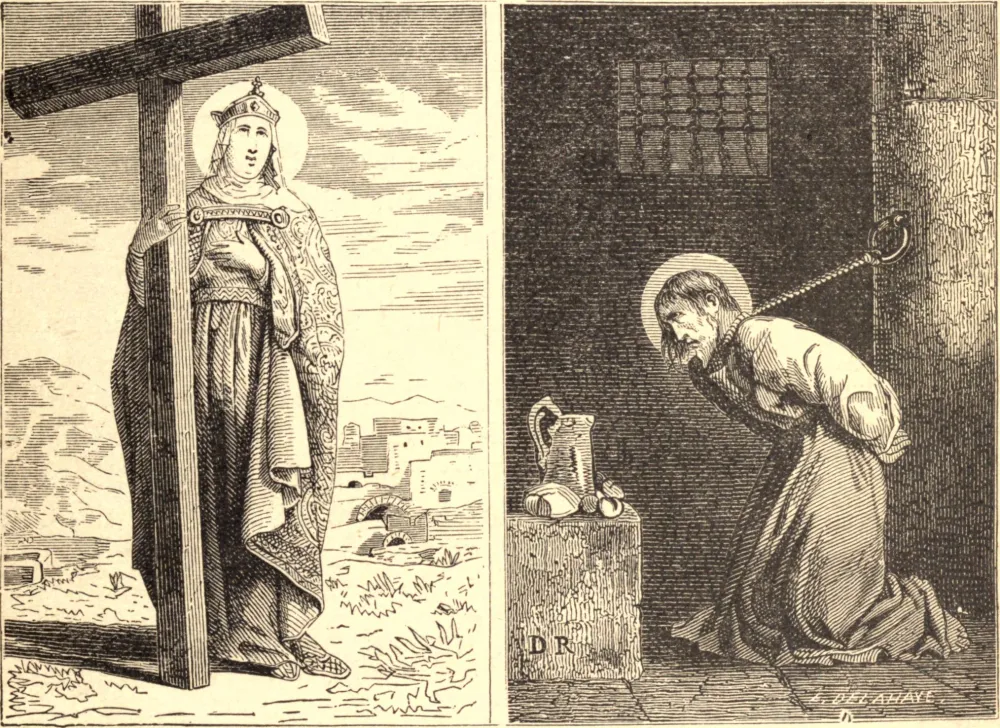

# 18 de agosto — SANTA HELENA, Imperatriz; SANTO AGAPITO, Mártir

FOI, por muitas eras, o piedoso orgulho da cidade de Colchester, na Inglaterra, que Santa Helena nascera dentro de seus muros; e, embora esta honra tenha sido disputada, é certo que ela era uma princesa britânica. Abraçou o Cristianismo já tarde na vida; mas sua fé e piedade incomparáveis influenciaram grandemente seu filho Constantino, o primeiro imperador cristão, e serviram para acender um santo zelo nos corações do povo romano. Esquecida de sua alta dignidade, ela se deleitava em assistir ao Ofício Divino entre os pobres; e por suas esmolas mostrava-se uma mãe para os indigentes e aflitos. Em seu octogésimo ano fez uma peregrinação a Jerusalém, com o ardente desejo de descobrir a cruz na qual padecera nosso bendito Redentor. Após muitos trabalhos, três cruzes foram encontradas no Monte Calvário, juntamente com os cravos e a inscrição registrada pelos Evangelistas. Restava ainda identificar a verdadeira cruz de Nosso Senhor. Por conselho do bispo Macário, as três foram aplicadas sucessivamente a uma mulher acometida de uma enfermidade incurável, e mal a terceira a tocou, ela se levantou, perfeitamente curada. A piedosa imperatriz, transportada de júbilo, edificou uma gloriosíssima igreja no Monte Calvário para receber a preciosa relíquia, enviando porções dela a Roma e a Constantinopla, onde foram solenemente expostas à adoração dos fiéis. No ano de 312, Constantino viu-se atacado por Maxêncio com forças imensamente superiores, e a própria existência de seu império ameaçada. Nesta crise, lembrou-se do Deus cristão crucificado a quem sua mãe Helena adorava, e, ajoelhando-se, rogou a Deus que se revelasse e lhe desse a vitória. De súbito, ao meio-dia, uma cruz de fogo foi vista por seu exército no céu calmo e sem nuvens, e abaixo dela as palavras *In hoc signo vinces* — "Por este sinal vencerás." Por mandado divino, Constantino fez um estandarte semelhante à cruz que vira, o qual foi levado à frente de suas tropas; e sob esta insígnia cristã marcharam contra o inimigo, e obtiveram completa vitória. Pouco depois, a própria Helena retornou a Roma, onde expirou, em 328.

SANTO AGAPITO padeceu em sua juventude um cruel martírio em Preneste, hoje chamada Palestrina, a vinte e quatro milhas de Roma, sob Aureliano, por volta do ano de 275. Seu nome é famoso nos antigos calendários da Igreja de Roma. Duas igrejas em Palestrina e outras em outros lugares são dedicadas a Deus sob o seu nome.

## Reflexão

Santa Helena considerava a glória de sua vida encontrar a cruz de Cristo, e erguer um templo em sua honra. Quantos cristãos nestes dias se envergonham de fazer este sinal vivificante, e de confessar-se seguidores do Crucificado!
