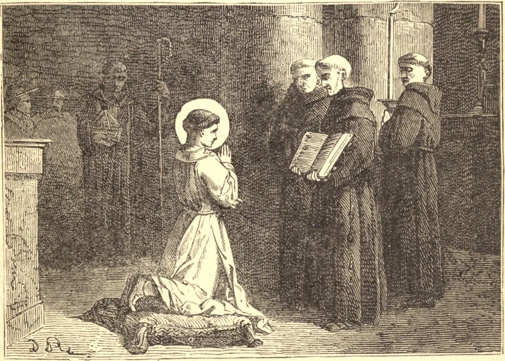

# 19 de agosto — SÃO LUÍS, Bispo

ESTE Santo era sobrinho-neto de São Luís, Rei da França, e sobrinho, por parte de mãe, de Santa Isabel da Hungria. Nasceu em Brignoles, na Provença, em 1274. Foi um Santo desde o berço, e desde a infância empenhou-se fervorosamente em não fazer nada que não fosse dirigido ao serviço divino, e com vistas unicamente à eternidade. Até suas recreações ele referia a este fim, e escolhia apenas aquelas que eram sérias e pareciam apenas necessárias para o exercício do corpo e a preservação do vigor da mente. Seus passeios geralmente o levavam a alguma igreja ou casa religiosa. Era seu principal deleite ouvir os servos de Deus discorrerem sobre a mortificação ou sobre as práticas mais perfeitas de piedade. Sua modéstia e recolhimento na igreja inspiravam devoção em todos os que o viam. Quando tinha apenas sete anos de idade, sua mãe o encontrava muitas vezes deitado durante a noite sobre uma esteira estendida no chão junto à sua cama, o que fazia por um precoce espírito de penitência.

Em 1284, o pai de nosso Santo, Carlos II, então Príncipe de Salerno, foi feito prisioneiro num combate naval pelo Rei de Aragão, e só foi libertado sob a condição de enviar a Aragão, como reféns, cinquenta gentis-homens e três de seus filhos, um dos quais era nosso Santo. Luís foi posto em liberdade em 1294, por um tratado concluído entre o Rei de Nápoles, seu pai, e Jaime II, Rei de Aragão, uma das condições do qual era o casamento de sua irmã Branca com o Rei de Aragão. Ambas as cortes tinham ao mesmo tempo extremamente a peito o projeto de um duplo casamento, e que a princesa de Maiorca, irmã do Rei Jaime de Aragão, fosse desposada por Luís, mas a resolução do Santo de consagrar-se a Deus era inflexível, e ele renunciou ao seu direito à coroa de Nápoles, que rogou ao pai conferir a seu irmão mais novo, Roberto.

A oposição de sua família obrigou os superiores dos Frades Menores a recusarem por algum tempo admiti-lo em sua congregação, pelo que ele recebeu as ordens sacras em Nápoles. O piedoso Papa São Celestino o havia nomeado Arcebispo de Lião em 1294; mas, como não havia ainda recebido a tonsura, ele encontrou meios de frustrar aquele projeto. Bonifácio VIII deu-lhe uma dispensa para receber as ordens sacerdotais aos vinte e três anos de idade, e depois lhe enviou semelhante dispensa para o caráter episcopal, juntamente com sua nomeação para o arcebispado de Toulouse, e severa injunção, em virtude da santa obediência, de aceitá-lo. Contudo, ele primeiro fez sua profissão religiosa entre os Frades Menores na véspera de Natal de 1296, e recebeu a consagração episcopal no início de fevereiro seguinte.

Viajou para o seu bispado como um pobre religioso, mas foi recebido em Toulouse com a veneração devida a um Santo e a magnificência que convinha a um príncipe. Sua modéstia, brandura e devoção inspiravam um amor à piedade em todos os que o contemplavam. Foi seu primeiro cuidado prover ao socorro do indigente, e suas primeiras visitas foram feitas aos hospitais e aos pobres. Em seus trabalhos apostólicos, ele nada abrandava de suas austeridades, dizia Missa todos os dias, e pregava frequentemente.

Sendo obrigado a ir à Provença para certos assuntos eclesiásticos muito urgentes, adoeceu no castelo de Brignoles. Vendo aproximar-se o seu fim, recebeu o Viático de joelhos, desfazendo-se em lágrimas, e em seus últimos momentos não cessou de repetir a Ave-Maria. Morreu no dia 19 de agosto de 1297, tendo apenas vinte e três anos e seis meses de idade.
