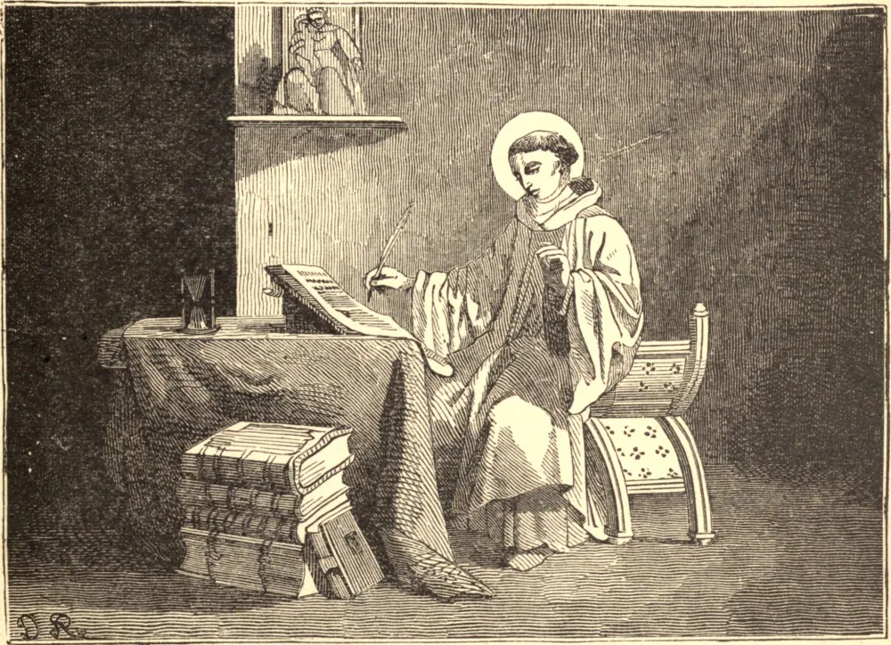

# 20 de agosto — SÃO BERNARDO

BERNARDO nasceu no castelo de Fontaines, na Borgonha. A graça de sua pessoa e o vigor de sua inteligência encheram seus pais das mais altas esperanças, e o mundo jazia diante dele brilhante e risonho quando ele a tudo renunciou para sempre e se uniu aos monges em Cister. Todos os seus irmãos seguiram Bernardo a Cister, exceto Nivardo, o mais novo, que foi deixado para ser o amparo de seu pai na velhice. "Serás agora herdeiro de tudo", disseram-lhe eles, ao partirem. "Sim", disse o menino; "deixais-me a terra, e guardais o céu para vós; chamais isto justo?" E também ele deixou o mundo. Por fim, seu idoso pai veio trocar riqueza e honra pela pobreza de um monge de Claraval. Apenas uma irmã ficou para trás; era casada, e amava o mundo e seus prazeres. Magnificamente vestida, ela visitou Bernardo; ele recusou-se a vê-la, e somente afinal consentiu em fazê-lo, não como seu irmão, mas como ministro de Cristo. As palavras que então proferiu comoveram-na tanto que, dois anos mais tarde, ela se retirou para um convento com o consentimento de seu marido, e morreu em reputação de santidade. O santo exemplo de Bernardo atraiu tantos noviços que outros mosteiros foram erigidos, e nosso Santo foi nomeado abade do de Claraval. Inflexível consigo mesmo, ele a princípio esperava demais de seus irmãos, que se desanimavam com sua severidade; mas, percebendo logo o seu erro, conduziu-os adiante, pela doçura de sua correção e pela brandura de sua regra, a uma admirável perfeição. Apesar de seu desejo de permanecer oculto, a fama de sua santidade espalhou-se por toda parte, e muitas igrejas o pediram para seu Bispo. Pela ajuda do Papa Eugênio III, seu antigo súdito, ele escapou dessa dignidade; contudo, seu retiro era continuamente invadido: os pobres e os fracos buscavam sua proteção; bispos, reis e papas recorriam a ele em busca de conselho; e por fim o próprio Eugênio o incumbiu de pregar a cruzada. Por seu fervor, sua eloquência e seus milagres, Bernardo acendeu o entusiasmo da cristandade, e dois esplêndidos exércitos foram despachados contra o infiel. Sua derrota deveu-se apenas, disse o Santo, a seus próprios pecados. Bernardo morreu em 1153. Seus preciosíssimos escritos lhe granjearam os títulos de o último dos Padres e Doutor da Santa Igreja.

## Reflexão

São Bernardo costumava dizer aos que pediam admissão ao mosteiro: "Se desejais entrar aqui, deixai no limiar o corpo que trouxestes convosco do mundo; aqui há lugar somente para a vossa alma." Façamos a nós mesmos constantemente a pergunta diária de São Bernardo: "A que fim vieste tu aqui?"
