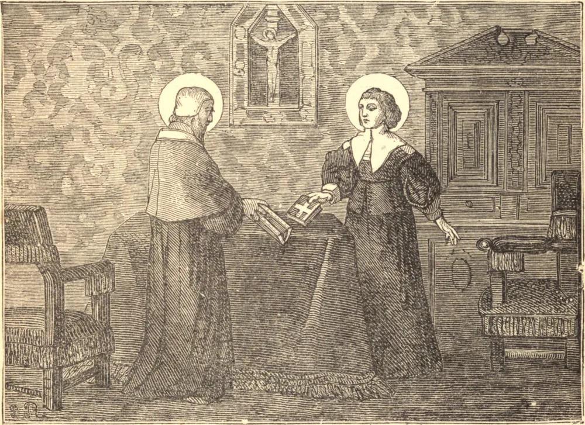

# 21 de agosto — SANTA JOANA FRANCISCA DE CHANTAL

AOS dezesseis anos de idade, Joana Francisca de Frémyot, já uma criança órfã de mãe, foi posta sob os cuidados de uma governanta de espírito mundano. Nesta crise, ofereceu-se à Mãe de Deus, e assegurou para toda a vida a proteção de Maria. Quando um protestante pediu a sua mão, ela recusou firmemente casar-se com "um inimigo de Deus e de sua Igreja", e pouco depois, como esposa amante e amada do Barão de Chantal, fez de sua casa o modelo de um lar cristão. Mas Deus a havia marcado para algo mais elevado do que a santidade doméstica. Dois filhos e uma irmã ternamente amada morreram, e, na plena maré da prosperidade, a vida de seu esposo foi tirada pela mão inocente de um amigo. Por sete anos, as dores de sua viuvez foram acrescidas pelos maus-tratos de servos e inferiores, e pelas cruéis importunações de amigos, que a instavam a casar-se de novo. Atormentada quase ao desespero por suas súplicas, ela gravou a ferro no coração o nome de Jesus, e por fim deixou seu amado lar e seus filhos para viver somente para Deus. Foi no dia 19 de março de 1609 que a Senhora de Chantal se despediu de sua família e parentes. Pálida, e com lágrimas nos olhos, ela percorreu o grande salão, despedindo-se de cada um com doçura e humildade. Seu filho, um menino de quinze anos, empregou toda súplica, todo carinho, para induzir a mãe a não os deixar, e por fim lançou-se apaixonadamente atravessado sobre a porta do salão. Numa agonia de aflição, ela prosseguiu por sobre o corpo de seu filho até o abraço de seu idoso e desconsolado pai. A angústia daquela despedida atingiu o auge quando, ajoelhando-se aos pés do venerável ancião, ela buscou e obteve a sua última bênção, prometendo retribuir em seu novo lar o sacrifício dele por suas orações. Bem podia São Francisco chamá-la "a mulher forte". Ela havia de fundar com São Francisco de Sales uma grande Ordem. Doença, oposição, penúria a assediaram, e a morte de filhos, de amigos, e do próprio São Francisco se seguiu, enquanto oitenta e sete casas da Visitação se erguiam sob sua mão. Nove longos anos de desolação interior completaram a obra da graça de Deus; e em seu septuagésimo ano São Vicente de Paulo viu, no momento de sua morte, a sua alma ascender, como uma bola de fogo, ao céu.

## Reflexão

Aproveita as sucessivas provações da vida para ganhar a força e a coragem de Santa Joana Francisca, e elas se tornarão degraus da terra para o céu.
