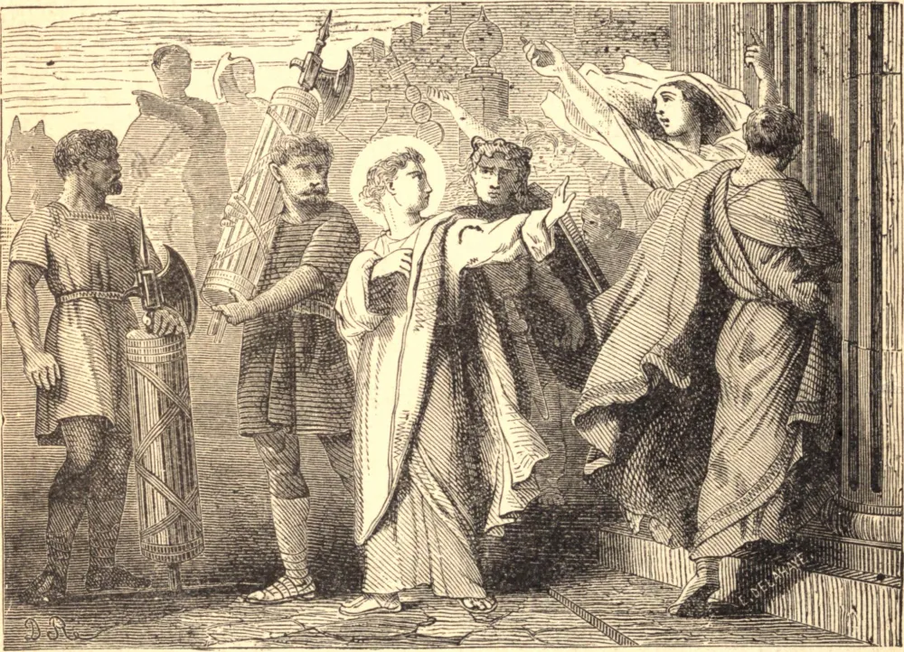

# 22 de agosto — SÃO SINFORIANO, Mártir

POR volta do ano de 180, houve uma grande procissão da deusa pagã Ceres, em Autun, na França. Entre a multidão estava um que se recusou a prestar as ordinárias mostras de culto. Foi por isso arrastado diante do magistrado e acusado de sacrilégio e sedição. Quando lhe perguntaram seu nome e condição, respondeu: "Meu nome é Sinforiano; eu sou cristão!" Provinha de uma família nobre e cristã. Era ainda jovem, e tão inocente que se dizia conversar com os santos anjos.

Os cristãos de Autun eram poucos e pouco conhecidos, e o juiz não podia crer que o jovem fosse sério em seu propósito. Mandou que se lessem as leis que impunham o culto pagão, e esperava uma pronta submissão. Sinforiano respondeu que devia obedecer às leis do Rei dos reis. "Dai-me um martelo", disse ele, "e despedaçarei o vosso ídolo." Foi flagelado e lançado num calabouço. Alguns dias depois, este filho da luz saiu da escuridão de sua prisão, macilento e abatido, mas cheio de alegria. Desprezou as riquezas e honras que lhe foram oferecidas como desprezara os tormentos. Morreu pela espada, e foi para a corte do Rei celestial.

A mãe de São Sinforiano achava-se sobre os muros da cidade e viu seu filho ser levado para morrer. Conhecia as honras que ele recusara e a desonra de sua morte, mas estimava o opróbrio de Cristo mais do que todas as riquezas do Egito, e bradou-lhe: "Meu filho, meu filho, guarda o Deus vivo em teu coração; olha para Aquele que reina no céu." Assim ela participou da glória de sua paixão, e seu nome vive com o dele nos registros da Igreja. Pouco mais de um século depois, o Império Romano inclinou-se diante da fé de Cristo. Muitos milagres difundiram a glória de São Sinforiano, e de Cristo, o Rei dos Santos.

**Reflexão**—A religião católica nos ensina a estar sujeitos a toda autoridade legítima. Mas nenhuma autoridade terrena tem direito algum contra Cristo e sua Igreja. Se formos acusados de sedição ou desobediência por sermos fiéis à nossa religião, então devemos escolher como escolheu São Sinforiano, e obedecer a Deus antes que aos homens.
