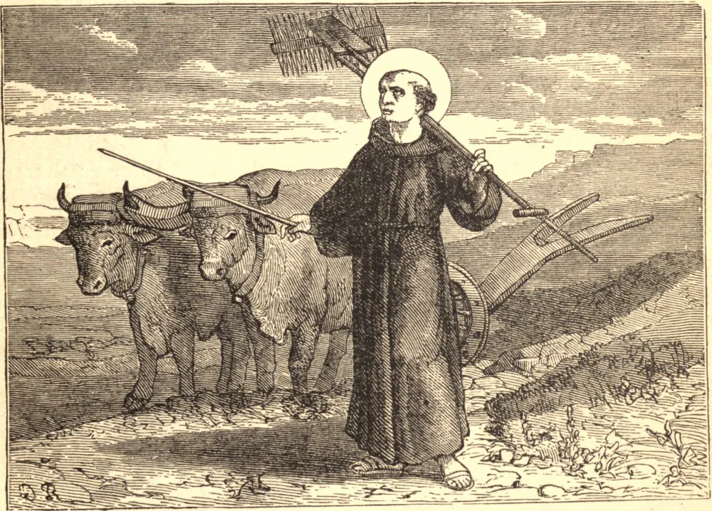

# 23 de agosto — SÃO FILIPE BENÍCIO

SÃO FILIPE BENÍCIO nasceu em Florença, na Festa da Assunção, em 1233. Naquele mesmo dia, a Ordem dos Servitas foi fundada pela Mãe de Deus. Sendo ainda um infante de peito, Filipe rompeu em palavras ao ver estes novos religiosos, e rogou à sua mãe que lhes desse esmola. Em meio a todas as tentações de sua juventude, ele ansiava por tornar-se ele próprio um servo de Maria, e foi somente o temor de sua própria indignidade que o levou a ceder ao desejo de seu pai e a começar a exercer a medicina. Após longa e fatigante espera, suas dúvidas foram resolvidas pela própria Nossa Senhora, que numa visão lhe ordenou entrar em sua Ordem. Ainda assim, Filipe ousou apenas oferecer-se como irmão leigo, e neste estado humilde esforçou-se por fazer penitência por seus pecados. Apesar de sua relutância, foi promovido ao posto de mestre de noviços; e, como suas raras capacidades eram dia após dia descobertas, foi-lhe ordenado preparar-se para o sacerdócio. Dali em diante, as honras se amontoaram sobre ele; tornou-se geral da Ordem, e só pela fuga escapou de ser elevado ao trono Papal. Sua pregação restituiu a paz à Itália, devastada por guerras civis; e no Concílio de Lião, ele falou aos prelados reunidos com o dom das línguas. Em meio a todos estes favores, Filipe vivia em extrema penitência, examinando constantemente a sua alma diante do tribunal de Deus, e condenando-se como digno somente do inferno. São Filipe, embora estivesse livre da mancha do pecado mortal, jamais se cansava de implorar a misericórdia de Deus. Desde a idade de dez anos, recitava diariamente os Salmos Penitenciais. Em seu leito de morte, não cessava de recitar os versículos do *Miserere*, com as faces banhadas em lágrimas; e durante a sua agonia atravessou um terrível combate para vencer o temor da danação. Mas, poucos minutos antes de morrer, todas as suas dúvidas desapareceram e foram sucedidas por uma santa confiança. Proferiu as respostas em voz baixa, porém audível; e quando afinal a Mãe de Deus se mostrou diante dele, ele ergueu os braços com alegria e exalou um suave suspiro, como que depondo a sua alma na mão dela. Morreu na Oitava da Assunção, em 1285.

## Reflexão

Esforça-te por agir como desejarias ter agido quando estiveres diante do teu Juiz. Esta é a regra dos Santos, e a única regra segura para todos.
