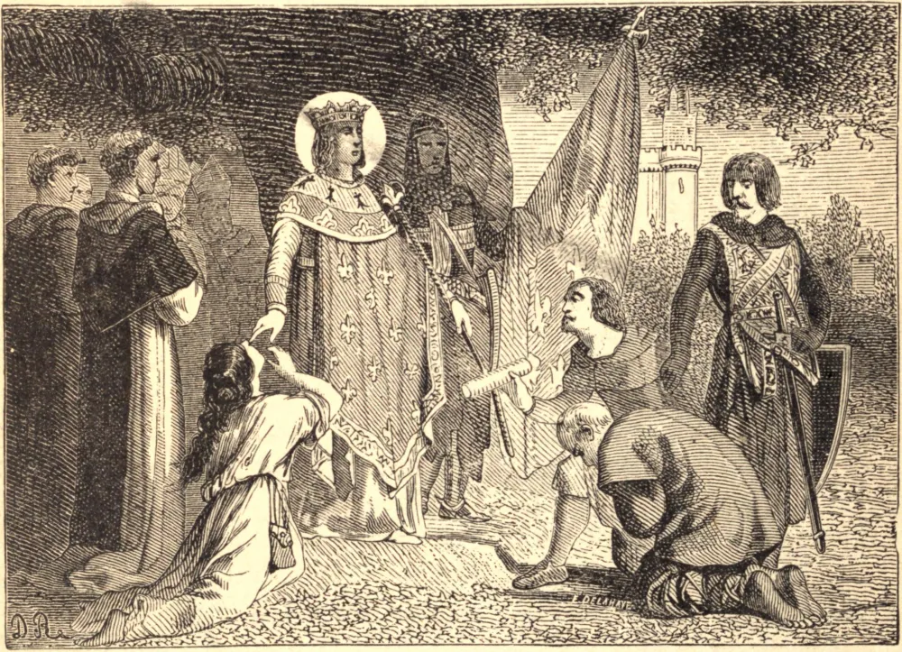

# 25 de agosto — SÃO LUÍS, Rei

A mãe de Luís lhe dizia que preferiria vê-lo morto a vê-lo cometer um pecado mortal, e ele nunca esqueceu as suas palavras. Rei da França aos doze anos de idade, fez da defesa da honra de Deus o alvo de sua vida. Antes de dois anos, havia esmagado os hereges albigenses, e os forçara, por rigorosas penalidades, a respeitar a fé católica. Em meio aos cuidados do governo, recitava diariamente o Ofício Divino e ouvia duas Missas, e as mais gloriosas igrejas da França são ainda monumentos de sua piedade. Quando seus cortesãos lhe fizeram reparos por sua lei segundo a qual os blasfemadores deviam ser marcados a ferro nos lábios, ele respondeu: "De boa vontade teria os meus próprios lábios marcados a ferro para extirpar a blasfêmia do meu reino." Destemido protetor do fraco e do oprimido, foi escolhido para arbitrar em todas as grandes contendas de sua época, entre o Papa e o Imperador, entre Henrique III e os barões ingleses. Em 1248, para resgatar a terra que Cristo pisara, reuniu em torno de si a cavalaria da França, e embarcou para o Oriente. Ali, diante do infiel, na vitória ou na derrota, no leito da doença ou cativo em cadeias, Luís mostrou-se sempre o mesmo — o primeiro, o melhor e o mais bravo dos cavaleiros cristãos. Quando cativo em Damieta, um Emir irrompeu em sua tenda brandindo um punhal vermelho com o sangue do Sultão, e ameaçou apunhalá-lo também a menos que o fizesse cavaleiro, como o Imperador Frederico fizera a Facardin. Luís respondeu serenamente que nenhum descrente podia cumprir os deveres de um cavaleiro cristão. No mesmo cativeiro, foi-lhe oferecida a liberdade sob termos em si mesmos lícitos, mas reforçados por um juramento que implicava uma blasfêmia, e, embora os infiéis mantivessem as pontas de suas espadas em sua garganta, e ameaçassem um massacre dos cristãos, Luís recusou-se inflexivelmente. A morte de sua mãe o chamou de volta à França; mas, quando a ordem foi restabelecida, ele novamente partiu numa segunda cruzada. Em agosto de 1270, seu exército desembarcou em Túnis, e, embora vitorioso sobre o inimigo, sucumbiu a uma febre maligna. Luís foi uma das vítimas. Recebeu o Viático ajoelhado junto ao seu leito de campanha, e entregou a sua vida com a mesma alegria com que dera tudo o mais pela honra de Deus.

## Reflexão

Se não podemos imitar São Luís em morrer pela honra de Deus, podemos ao menos assemelhar-nos a ele em ressentir-nos das blasfêmias proferidas contra Deus pelo infiel, pelo herege e pelo escarnecedor.
