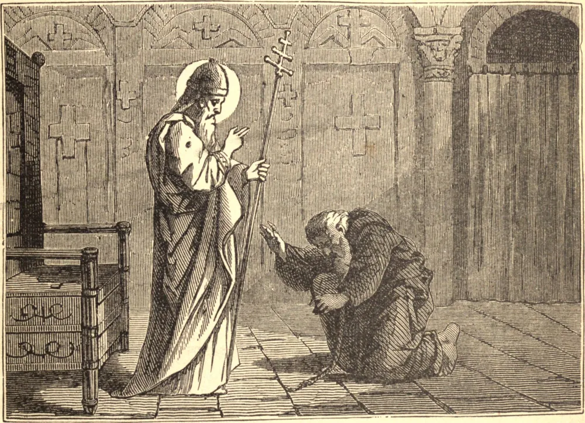

# 26 de agosto — SÃO ZEFERINO, Papa e Mártir

ZEFERINO, natural de Roma, sucedeu a Vítor no pontificado, no ano de 202, no qual Severo levantou a quinta e mais sanguinária perseguição contra a Igreja, a qual durou não somente dois anos, mas até a morte daquele imperador, em 211. Sob esta furiosa tempestade, este santo pastor foi o sustento e o consolo do aflito rebanho de Cristo, e padeceu por caridade e compaixão o que todo confessor padecia. Os triunfos dos mártires eram, em verdade, a sua alegria, mas o seu coração recebeu muitas profundas feridas com a queda dos apóstatas e hereges.

Nem cessou esta última aflição quando a paz foi restituída à Igreja. Teve nosso Santo também a aflição de ver a queda de Tertuliano, que parece ter-se devido em parte ao seu orgulho. Eusébio nos conta que este santo Papa exerceu o seu zelo tão denodadamente contra as blasfêmias dos hereges que estes o trataram da maneira mais ultrajante; mas foi a sua glória que o chamassem o principal defensor da divindade de Cristo.

São Zeferino ocupou a cátedra pontifícia dezessete anos, morrendo em 219. Foi sepultado em seu próprio cemitério, no dia 26 de agosto. É, em alguns Martirológios, intitulado mártir, título que poderia merecer pelo que padeceu na perseguição, ainda que talvez não tenha morrido pelas mãos do carrasco.

**Reflexão**—Deus sempre suscitou santos pastores zelosos por manter inviolável a fé de sua Igreja, e por velar sobre a pureza de seus costumes e a santidade de sua disciplina. Gozamos das maiores vantagens da graça divina por meio de seus trabalhos, e devemos a Deus um tributo de perpétua ação de graças e de imortal louvor por todas aquelas misericórdias que Ele concedeu à sua Igreja na terra.
