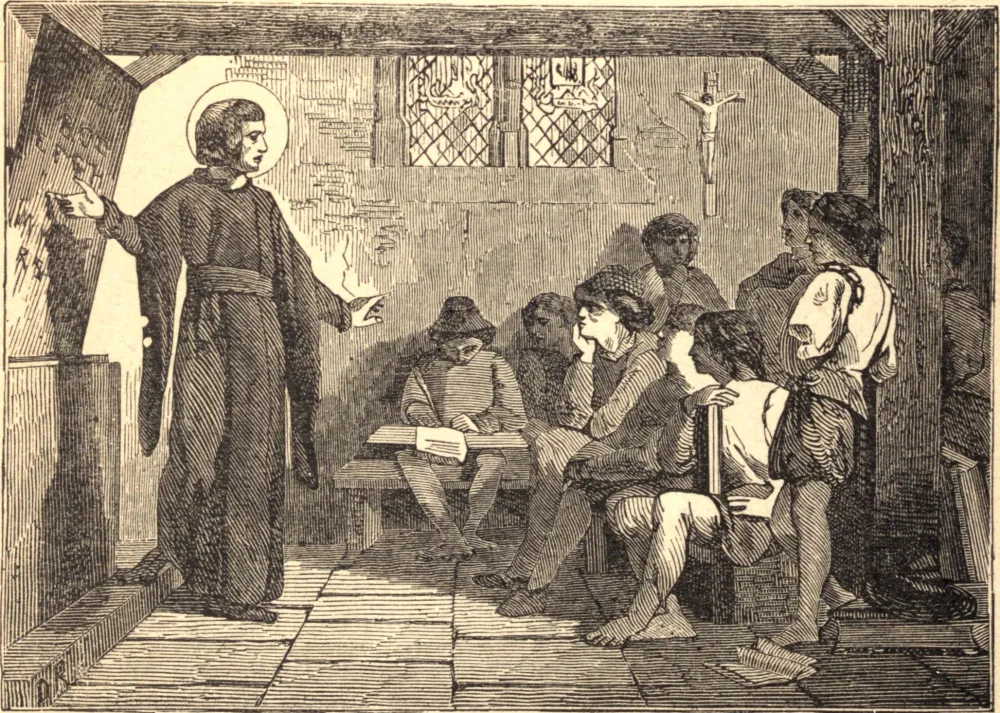

# 27 de agosto — SÃO JOSÉ DE CALASANZ

SÃO JOSÉ DE CALASANZ nasceu em Aragão, em 1556. Quando tinha apenas cinco anos de idade, conduziu um bando de crianças pelas ruas para encontrar o demônio e matá-lo. Tornou-se sacerdote, e estava empenhado em várias reformas, quando ouviu uma voz que dizia: "Vai a Roma", e teve uma visão de muitas crianças que eram ensinadas por ele e por uma companhia de anjos. Quando chegou à Cidade Santa, seu coração comoveu-se com o vício e a ignorância das crianças dos pobres. A necessidade delas venceu sua humildade, e ele fundou a Ordem dos Clérigos Regulares das Escolas Pias. Ele mesmo provia tudo o que era necessário para a educação das crianças, nada recebendo delas em pagamento, e logo havia cerca de mil alunos de toda condição sob seus cuidados. Cada lição começava com oração. A cada meia hora a devoção era renovada por atos de fé, esperança e caridade, e perto do fim do tempo de aula as crianças eram instruídas na doutrina cristã. Eram então escoltadas para casa pelos mestres, a fim de escapar de todo mal pelo caminho. Mas surgiram inimigos contra José dentre seus próprios súditos. Acusaram-no ao Santo Ofício, e com a idade de oitenta e seis anos ele foi conduzido pelas ruas até a prisão. Por fim a Ordem foi reduzida a uma simples congregação. Não foi restaurada aos seus antigos privilégios senão depois da morte do Santo. Contudo ele morreu cheio de esperança. "Minha obra", disse ele, "foi feita unicamente pelo amor de Deus."

## Reflexão

"Meus filhos", dizia o Cura d'Ars, "penso muitas vezes que a maior parte dos cristãos que se perdem, perdem-se por falta de instrução; não conhecem bem a sua religião."
