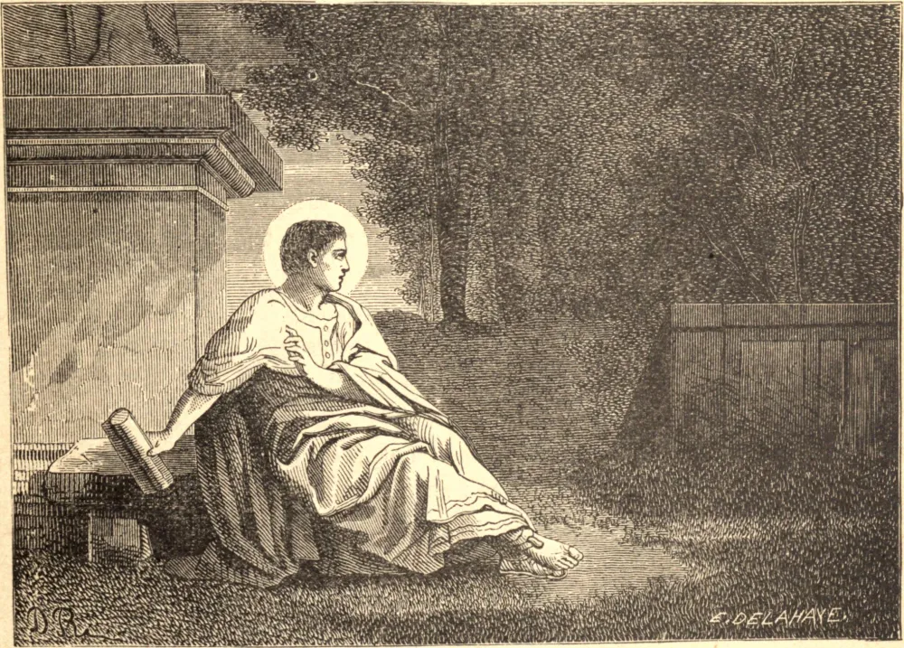

# 28 de agosto — SANTO AGOSTINHO DE HIPONA

SANTO AGOSTINHO nasceu em 354, em Tagaste, na África. Foi criado na fé cristã, mas sem receber o batismo. Estudante ambicioso, de talentos brilhantes e paixões violentas, cedo perdeu tanto a sua fé quanto a sua inocência. Persistiu em sua vida desregrada até os trinta e dois anos. Estando então em Milão, professando a retórica, ele nos conta que a fé de sua infância havia retomado posse de seu intelecto, mas que ainda não conseguia resolver-se a romper as cadeias do mau hábito. Um dia, porém, ferido no coração pelo relato de algumas conversões súbitas, ele exclamou: "Os ignorantes se levantam e tomam de assalto o céu, e nós, com toda a nossa ciência, por falta de coração, jazemos aqui, chafurdando." Retirou-se então para um jardim, onde se seguiu um longo e terrível conflito. De repente, uma voz jovem e fresca (não sabe de quem) irrompe em meio à sua luta com as palavras: "Toma e lê"; e ele depara com a passagem que começa: "Andai honestamente, como em pleno dia." A batalha estava ganha. Recebeu o batismo, voltou para casa, e deu tudo aos pobres. Em Hipona, onde se estabeleceu, foi consagrado bispo em 395. Durante trinta e cinco anos foi o centro da vida eclesiástica na África, e o mais poderoso campeão da Igreja contra a heresia; ao passo que seus escritos têm sido aceitos por toda parte como uma das principais fontes do pensamento devocional e da especulação teológica. Morreu em 430.

## Reflexão

Lede as vidas dos Santos, e vereis que ides gradualmente criando em torno de vós uma sociedade à qual, em certa medida, sereis forçados a elevar o padrão de vossa vida diária.
