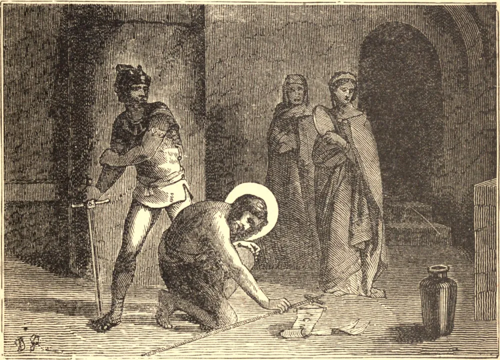

# 29 de agosto — A DEGOLAÇÃO DE SÃO JOÃO BATISTA

SÃO JOÃO BATISTA foi chamado por Deus a ser o precursor de seu divino Filho. A fim de preservar imaculada a sua inocência, e de aprimorar as graças extraordinárias que havia recebido, foi dirigido pelo Espírito Santo a levar uma vida austera e contemplativa no deserto, nos contínuos exercícios de oração devota e penitência, desde a sua infância até os trinta anos de idade. Nesta idade, o fiel ministro começou a desempenhar a sua missão. Revestido das vestes da penitência, anunciou a todos os homens a obrigação que lhes incumbia de lavar as suas iniquidades com as lágrimas de sincera compunção; e proclamou o Messias, que então vinha fazer a sua aparição entre eles. Foi recebido pelo povo como o verdadeiro arauto do Deus altíssimo, e a sua voz era, por assim dizer, uma trombeta a soar do céu para convocar todos os homens a desviar os juízos divinos, e a preparar-se para colher o benefício da misericórdia que lhes era oferecida. Tendo o tetrarca Herodes Antipas, em desafio a todas as leis divinas e humanas, desposado Herodíades, mulher de seu irmão Filipe, que ainda vivia, São João Batista repreendeu corajosamente o tetrarca e a sua cúmplice por tão escandaloso incesto e adultério, e Herodes, impelido pela luxúria e pela ira, lançou o Santo na prisão. Cerca de um ano depois de São João haver sido feito prisioneiro, Herodes ofereceu um esplêndido banquete à nobreza da Galileia. Salomé, filha de Herodíades com seu legítimo esposo, agradou a Herodes com sua dança, de tal modo que ele lhe prometeu conceder tudo o que pedisse. Diante disto, Salomé consultou com sua mãe o que pedir. Herodíades instruiu a filha a exigir a morte de João Batista, e persuadiu a jovem donzela a fazer parte de seu pedido que a cabeça do prisioneiro lhe fosse imediatamente trazida num prato. Esta estranha exigência sobressaltou o próprio tirano; ele consentiu, porém, e enviou um soldado de sua guarda a decapitar o Santo na prisão, com a ordem de trazer-lhe a cabeça numa bandeja e apresentá-la a Salomé, que a entregou à sua mãe. São Jerônimo relata que a furiosa Herodíades fez seu desumano passatempo de furar a sagrada língua com um alfinete. Assim morreu o grande precursor de nosso bendito Salvador, cerca de dois anos e três meses após o início de seu ministério público, cerca de um ano antes da morte de nosso bendito Redentor.

## Reflexão

Todas as elevadas graças com que São João foi favorecido brotaram de sua humildade; nesta se fundavam todas as suas demais virtudes. Se desejamos formar-nos sobre tão grande modelo, devemos, acima de tudo, esforçar-nos por lançar o mesmo profundo fundamento.
